# AirPainter AI Studio
## Complete Product Requirement Document (PRD) + Master Prompt + Development Blueprint

---

> **Document Version**: 1.0  
> **Date**: July 2026  
> **Product Name**: AirPainter AI Studio  
> **Platforms**: Android, iOS  
> **Engine**: Unity 6.3 LTS (6000.3)  
> **Language**: C#  
> **AI Stack**: MediaPipe Hands (v0.16.3) + Pose + Unity Sentis / TFLite  
> **Backend**: Firebase SDK v13.x  
> **AR**: AR Foundation 6.3  
> **Rendering**: Universal Render Pipeline (URP)  
> **Note**: HDRP is officially in maintenance mode — URP is the unified future pipeline

---

# TABLE OF CONTENTS

1. [Executive Summary](#1-executive-summary)
2. [Product Vision & Strategy](#2-product-vision--strategy)
3. [Technical Architecture](#3-technical-architecture)
4. [System Requirements & Environment](#4-system-requirements--environment)
5. [Core Module Specifications](#5-core-module-specifications)
6. [Gesture Recognition System](#6-gesture-recognition-system)
7. [Drawing Engine](#7-drawing-engine)
8. [Brush & Color System](#8-brush--color-system)
9. [Layer System](#9-layer-system)
10. [AI Features Module](#10-ai-features-module)
11. [AR Mode](#11-ar-mode)
12. [Multiplayer System](#12-multiplayer-system)
13. [Voice Command System](#13-voice-command-system)
14. [Save/Load & Gallery](#14-saveload--gallery)
15. [UI/UX Design System](#15-uiux-design-system)
16. [Screen-by-Screen Specifications](#16-screen-by-screen-specifications)
17. [Database & API Design](#17-database--api-design)
18. [Authentication & User Management](#18-authentication--user-management)
19. [Monetization & In-App Purchases](#19-monetization--in-app-purchases)
20. [Gamification System](#20-gamification-system)
21. [Performance Optimization](#21-performance-optimization)
22. [Folder Structure & Code Architecture](#22-folder-structure--code-architecture)
23. [Development Phases & Sprint Plan](#23-development-phases--sprint-plan)
24. [Testing Strategy](#24-testing-strategy)
25. [Deployment & Release](#25-deployment--release)
26. [Future Roadmap](#26-future-roadmap)
27. [Appendices](#27-appendices)

---

# 1. EXECUTIVE SUMMARY

## 1.1 Product Overview

AirPainter AI Studio is a revolutionary **touch-free digital art creation application** that enables users to paint and draw in the air using only hand gestures captured through the device camera. The app combines real-time hand tracking, gesture recognition, augmented reality, and AI-powered drawing assistance to deliver a premium digital art experience.

## 1.2 Problem Statement

Traditional digital art tools require direct touch interaction with screens, limiting creative expression and causing ergonomic issues. Current air-painting apps are rudimentary, offering limited brush options, no AI assistance, and poor gesture recognition accuracy.

## 1.3 Solution

AirPainter AI Studio addresses these gaps by providing:
- **Precise hand tracking** with < 50ms latency using MediaPipe
- **Intelligent gesture recognition** for natural drawing controls
- **Professional-grade drawing tools** (brushes, layers, colors)
- **AI-powered assistance** (sketch completion, style transfer, auto-coloring)
- **AR wall painting** for real-world art projection
- **Multiplayer drawing** for collaborative creation
- **Voice commands** for hands-free control

## 1.4 Target Audience

| Segment | Description | Priority |
|---------|-------------|----------|
| Digital Artists | Professional and amateur digital artists seeking new mediums | Primary |
| AR Enthusiasts | Tech-savvy users interested in AR creative tools | Primary |
| Casual Creators | People who enjoy casual drawing and doodling | Secondary |
| Education | Students and teachers using art in education | Secondary |
| Therapy | Art therapists using motion-based therapy | Tertiary |
| Kids | Children (6+) for fun interactive drawing | Tertiary |

## 1.5 Key Metrics (KPIs)

| Metric | Target (3 months) | Target (12 months) |
|--------|-------------------|---------------------|
| Downloads | 100K | 1M |
| DAU | 10K | 100K |
| Session Length | 8 min avg | 15 min avg |
| Retention (D7) | 25% | 40% |
| Conversion (Free→Premium) | 3% | 8% |
| App Store Rating | 4.2+ | 4.5+ |
| Crash Rate | < 1% | < 0.5% |

---

# 2. PRODUCT VISION & STRATEGY

## 2.1 Vision Statement

> *"Empower every person to create stunning digital art in the air, using nothing but their hands and imagination — powered by AI, enhanced by AR, and delivered through a premium touch-free experience."*

## 2.2 Competitive Analysis

| Feature | AirPainter AI Studio | Competitor A (AR Draw) | Competitor B (SketchAR) |
|---------|---------------------|----------------------|------------------------|
| Hand Tracking | ✅ MediaPipe 21-point | ❌ Touch only | ⚠️ Basic |
| Gesture Control | ✅ Full gesture suite | ❌ None | ⚠️ Limited |
| AI Assistance | ✅ Sketch completion, style transfer | ❌ None | ⚠️ Tracing only |
| AR Mode | ✅ Wall painting + 3D | ⚠️ Basic AR | ✅ AR tracing |
| Multiplayer | ✅ Real-time collaboration | ❌ None | ❌ None |
| Layers | ✅ Unlimited layers | ❌ None | ⚠️ Basic |
| Voice Commands | ✅ Full voice control | ❌ None | ❌ None |
| Premium UI | ✅ Glassmorphism, animations | ⚠️ Basic | ⚠️ Basic |
| Offline Mode | ✅ Core features offline | ⚠️ Limited | ✅ Yes |

## 2.3 Unique Value Propositions

1. **Touch-Free Creation**: Complete drawing workflow without touching the screen
2. **AI Co-Creator**: AI assists, corrects, and enhances artwork in real-time
3. **AR Art Projection**: Paint on real-world walls and surfaces
4. **Social Drawing**: Real-time multiplayer collaborative art
5. **Premium Experience**: Glassmorphism UI with smooth animations and sound design

---

# 3. TECHNICAL ARCHITECTURE

## 3.1 High-Level Architecture Diagram

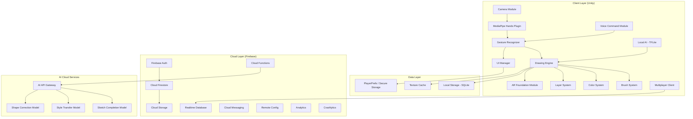

## 3.2 Technology Stack

### Engine & Runtime
| Component | Technology | Version |
|-----------|-----------|---------|
| Game Engine | Unity | 6.3 LTS (6000.3) — support through Dec 2027 |
| Scripting | C# | .NET Standard 2.1 |
| Rendering Pipeline | URP | `com.unity.render-pipelines.universal` (latest for Unity 6.3) |
| AR Framework | AR Foundation | 6.3 (`com.unity.xr.arfoundation`) |
| AR Android | ARCore XR Plugin | 6.3 (`com.unity.xr.arcore`) |
| AR iOS | ARKit XR Plugin | 6.3 (`com.unity.xr.arkit`) |

### AI & ML
| Component | Technology | Purpose |
|-----------|-----------|---------|
| Hand Tracking | MediaPipe Hands (homuler/MediaPipeUnityPlugin v0.16.3) | 21 landmark detection |
| Pose Estimation | MediaPipe Pose | Full body pose (optional) |
| On-Device ML | Unity Sentis (`com.unity.sentis`) — ONNX models | Gesture classification |
| On-Device ML Alt | TFLite Plugin (asus4, TFLite v2.21.0) | Quantized edge models |
| Cloud AI | Custom Flask/FastAPI | Style transfer, sketch completion |
| Shape Correction | Custom ONNX → Sentis | Real-time shape smoothing |

### Backend & Cloud
| Component | Technology | Purpose |
|-----------|-----------|---------|
| Authentication | Firebase Auth (SDK v13.x) | Email, Google, Apple Sign-In |
| Database | Cloud Firestore (SDK v13.x) | User data, projects, gallery |
| File Storage | Cloud Storage (requires Blaze plan) | Artworks, brush packs, assets |
| Real-time Sync | Firebase Realtime Database | Multiplayer drawing sync |
| Server Logic | Cloud Functions (Node.js 18+) | AI proxy, data processing |
| Push Notifications | Cloud Messaging | Challenges, social alerts |
| Remote Config | Firebase Remote Config | Feature flags, A/B testing |
| Analytics | Firebase Analytics | User behavior tracking |
| Crash Reporting | Firebase Crashlytics | Error monitoring |

### Third-Party SDKs
| SDK | Purpose |
|-----|---------|
| Photon Fusion (Shared Mode) | Multiplayer networking (~50ms latency, recommended) |
| Unity IAP | In-app purchases |
| Google AdMob | Rewarded ads (free tier) |
| Unity Recorder | Screen recording |
| DOTween | UI animations |
| TextMeshPro | Premium text rendering |

## 3.3 Architecture Patterns

### Design Patterns Used

1. **MVC (Model-View-Controller)**: Core app architecture
2. **Observer Pattern**: Event-driven gesture callbacks
3. **Command Pattern**: Undo/Redo system
4. **Strategy Pattern**: Brush rendering strategies
5. **Factory Pattern**: Brush/tool creation
6. **Singleton Pattern**: Manager classes (use sparingly)
7. **Object Pooling**: Stroke point recycling
8. **State Machine**: App state management (Drawing, Menu, AR, Multiplayer)

### Dependency Injection
```csharp
// Using a lightweight service locator / DI approach
public static class ServiceLocator
{
    private static Dictionary<Type, object> services = new();

    public static void Register<T>(T service) => services[typeof(T)] = service;
    public static T Get<T>() => (T)services[typeof(T)];
}
```

---

# 4. SYSTEM REQUIREMENTS & ENVIRONMENT

## 4.1 Minimum Device Requirements

### Android
| Specification | Minimum | Recommended |
|---------------|---------|-------------|
| OS Version | Android 8.0 (API 26) | Android 11+ (API 30) |
| ARCore Support | Required | Required |
| RAM | 3 GB | 6 GB+ |
| GPU | Adreno 506+ / Mali-G71+ | Adreno 640+ / Mali-G77+ |
| Camera | Front-facing, 720p | Front-facing, 1080p |
| Storage | 200 MB free | 500 MB free |
| Processor | Snapdragon 625+ | Snapdragon 730+ |

### iOS
| Specification | Minimum | Recommended |
|---------------|---------|-------------|
| OS Version | iOS 14.0 | iOS 16+ |
| ARKit Support | Required (A9+ chip) | Required |
| RAM | 3 GB | 4 GB+ |
| Device | iPhone 8 / iPad 6th Gen | iPhone 12+ / iPad Pro |
| Camera | Front-facing, 720p | Front-facing, 1080p (TrueDepth) |
| Storage | 200 MB free | 500 MB free |

## 4.2 Development Environment

| Tool | Version | Purpose |
|------|---------|---------|
| Unity Editor | 6.3 LTS (6000.3) | Main IDE (min: Windows 10 21H1+ / macOS Ventura 13.0+) |
| Visual Studio / Rider | Latest | C# development |
| Android Studio | Latest | Android build tools |
| Xcode | Latest | iOS build tools |
| Python | 3.10+ | AI model training/serving |
| Node.js | 18+ | Cloud Functions |
| Firebase CLI | Latest | Firebase deployment |
| Git | Latest | Version control |
| Blender | 3.6+ | 3D asset creation |
| Figma | Latest | UI/UX design |

## 4.3 Unity Project Settings

```
Player Settings:
  Company Name: "AirPainterStudio"
  Product Name: "AirPainter AI Studio"
  Default Icon: [Custom App Icon]
  
  Android:
    Min API Level: 26 (Android 8.0)
    Target API Level: 34 (Android 14)
    Scripting Backend: IL2CPP
    Target Architecture: ARM64
    Graphics APIs: OpenGLES3, Vulkan
    
  iOS:
    Min iOS Version: 14.0
    Architecture: ARM64
    Scripting Backend: IL2CPP
    Camera Usage Description: "AirPainter needs camera access for hand tracking and AR painting"
    Microphone Usage Description: "AirPainter uses microphone for voice commands"

  Quality Settings:
    Mobile Default: Medium
    VSync: Don't Sync (use Application.targetFrameRate = 60)
    Anti-Aliasing: 2x
    Shadow Distance: 20
    Texture Quality: Full

  URP Settings:
    Render Scale: 0.85 (mobile optimization)
    HDR: Off (mobile)
    MSAA: 2x
    Shadow Cascade: 2
```

---

# 5. CORE MODULE SPECIFICATIONS

## 5.1 Camera Module

### Purpose
Captures real-time camera feed for hand tracking and AR rendering.

### Technical Specification

```csharp
// CameraManager.cs
public class CameraManager : MonoBehaviour
{
    [Header("Configuration")]
    public CameraFacing cameraFacing = CameraFacing.Front;
    public Vector2Int targetResolution = new Vector2Int(1280, 720);
    public int targetFPS = 30; // Camera FPS (separate from app FPS)
    
    [Header("Processing")]
    public bool flipHorizontally = true; // Mirror mode for front camera
    public float exposureCompensation = 0f;
    
    // Events
    public event Action<Texture2D> OnFrameCaptured;
    public event Action<CameraState> OnStateChanged;
}
```

### Camera Pipeline
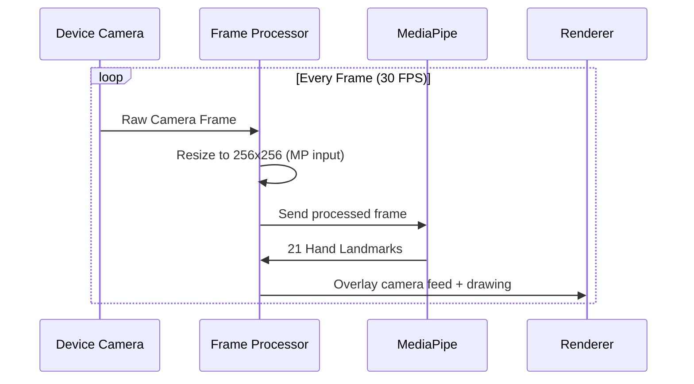

### Performance Requirements
| Metric | Target |
|--------|--------|
| Camera Initialization | < 1 second |
| Frame Capture Latency | < 16ms (60 FPS) |
| Resolution Scaling | Dynamic based on device capability |
| Memory Usage | < 50 MB for camera buffer |

---

## 5.2 Hand Tracking Module

### Purpose
Real-time detection and tracking of hand landmarks using MediaPipe.

### MediaPipe Integration Architecture

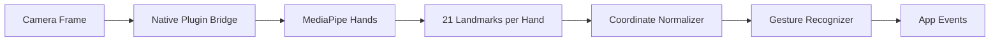

### Integration Approach: Native Plugin Bridge

**Android (Java/Kotlin → C# via AndroidJavaObject)**
```csharp
// MediaPipeAndroidBridge.cs
public class MediaPipeAndroidBridge : IHandTracker
{
    private AndroidJavaObject mediaPipePlugin;
    
    public void Initialize()
    {
        #if UNITY_ANDROID && !UNITY_EDITOR
        AndroidJavaClass unityPlayer = new AndroidJavaClass("com.unity3d.player.UnityPlayer");
        AndroidJavaObject activity = unityPlayer.GetStatic<AndroidJavaObject>("currentActivity");
        mediaPipePlugin = new AndroidJavaObject("com.airpainter.mediapipe.HandTracker", activity);
        mediaPipePlugin.Call("initialize", maxHands: 2, confidence: 0.7f);
        #endif
    }
    
    public HandLandmarkData[] GetLandmarks()
    {
        // Returns array of 21 landmarks per detected hand
        // Each landmark: {x, y, z, visibility}
    }
}
```

**iOS (Objective-C/Swift → C# via UnitySendMessage)**
```csharp
// MediaPipeiOSBridge.cs
public class MediaPipeiOSBridge : IHandTracker
{
    [DllImport("__Internal")]
    private static extern void _initializeMediaPipe(int maxHands, float confidence);
    
    [DllImport("__Internal")]
    private static extern IntPtr _getHandLandmarks();
    
    public void Initialize()
    {
        #if UNITY_IOS && !UNITY_EDITOR
        _initializeMediaPipe(2, 0.7f);
        #endif
    }
}
```

### Hand Landmark Data Structure

```csharp
[System.Serializable]
public struct HandLandmark
{
    public Vector3 position;     // Normalized (0-1) x, y, z
    public float visibility;     // Confidence 0-1
    public LandmarkType type;    // Enum: WRIST, THUMB_CMC, etc.
}

public enum LandmarkType
{
    WRIST = 0,
    THUMB_CMC = 1,
    THUMB_MCP = 2,
    THUMB_IP = 3,
    THUMB_TIP = 4,
    INDEX_MCP = 5,
    INDEX_PIP = 6,
    INDEX_DIP = 7,
    INDEX_TIP = 8,
    MIDDLE_MCP = 9,
    MIDDLE_PIP = 10,
    MIDDLE_DIP = 11,
    MIDDLE_TIP = 12,
    RING_MCP = 13,
    RING_PIP = 14,
    RING_DIP = 15,
    RING_TIP = 16,
    PINKY_MCP = 17,
    PINKY_PIP = 18,
    PINKY_DIP = 19,
    PINKY_TIP = 20
}

[System.Serializable]
public class HandData
{
    public HandLandmark[] landmarks = new HandLandmark[21];
    public Handedness handedness;  // LEFT or RIGHT
    public float confidence;       // Overall detection confidence
    public bool isTracked;
}
```

### Tracking Specifications

| Parameter | Value |
|-----------|-------|
| Max Hands Tracked | 2 |
| Landmarks Per Hand | 21 |
| Min Detection Confidence | 0.7 |
| Min Tracking Confidence | 0.5 |
| Processing Resolution | 256 × 256 |
| Target Detection FPS | 30 |
| Max Latency | 50ms |
| Coordinate System | Normalized [0, 1] → Screen Space |

---

# 6. GESTURE RECOGNITION SYSTEM

## 6.1 Gesture Definitions

### Primary Gestures

| Gesture | Action | Detection Method | Priority |
|---------|--------|------------------|----------|
| Index Finger Extended | Draw Mode | Index finger straight, others curled | P0 |
| Pinch (Thumb + Index) | Start/Stop Drawing | Distance < threshold between tips | P0 |
| Open Palm | Open Color Menu | All fingers extended, spread apart | P0 |
| Two Fingers (V-Sign) | Adjust Brush Size | Index + Middle extended, others curled | P0 |
| Fist | Eraser Mode | All fingers curled | P0 |
| Swipe Left | Undo | Hand velocity > threshold, direction left | P1 |
| Swipe Right | Redo | Hand velocity > threshold, direction right | P1 |
| Circle Gesture | Color Wheel | Index tip traces circular path | P1 |
| Thumbs Up | Save Artwork | Thumb extended, others curled | P1 |
| Peace Sign Rotate | Rotate Canvas | Two fingers rotating | P2 |
| Pinch Spread | Zoom Canvas | Both hands pinch + spread | P2 |

### Gesture Detection Algorithms

```csharp
// GestureDetector.cs
public class GestureDetector
{
    // --- Finger State Detection ---
    
    public bool IsFingerExtended(HandData hand, FingerType finger)
    {
        // For thumb: compare TIP to IP joint position relative to hand orientation
        // For other fingers: compare angle between MCP-PIP and PIP-DIP segments
        
        switch (finger)
        {
            case FingerType.INDEX:
                var mcpToTip = hand.landmarks[8].position - hand.landmarks[5].position;
                var mcpToPip = hand.landmarks[6].position - hand.landmarks[5].position;
                float angle = Vector3.Angle(mcpToTip, mcpToPip);
                return angle < 30f; // Nearly straight
                
            // Similar for other fingers...
        }
    }
    
    // --- Pinch Detection ---
    
    public bool IsPinching(HandData hand, out float pinchStrength)
    {
        float distance = Vector3.Distance(
            hand.landmarks[(int)LandmarkType.THUMB_TIP].position,
            hand.landmarks[(int)LandmarkType.INDEX_TIP].position
        );
        
        const float PINCH_THRESHOLD = 0.05f;  // Normalized distance
        const float PINCH_MAX = 0.15f;
        
        pinchStrength = 1f - Mathf.InverseLerp(PINCH_THRESHOLD, PINCH_MAX, distance);
        return distance < PINCH_THRESHOLD;
    }
    
    // --- Open Palm Detection ---
    
    public bool IsOpenPalm(HandData hand)
    {
        // All 5 fingers must be extended
        // Fingers must be spread (angle between adjacent fingers > threshold)
        bool allExtended = IsFingerExtended(hand, FingerType.THUMB)
                        && IsFingerExtended(hand, FingerType.INDEX)
                        && IsFingerExtended(hand, FingerType.MIDDLE)
                        && IsFingerExtended(hand, FingerType.RING)
                        && IsFingerExtended(hand, FingerType.PINKY);
                        
        float spread = CalculateFingerSpread(hand);
        return allExtended && spread > 0.3f;
    }
    
    // --- Fist Detection ---
    
    public bool IsFist(HandData hand)
    {
        // No fingers extended, all curled tightly
        return !IsFingerExtended(hand, FingerType.THUMB)
            && !IsFingerExtended(hand, FingerType.INDEX)
            && !IsFingerExtended(hand, FingerType.MIDDLE)
            && !IsFingerExtended(hand, FingerType.RING)
            && !IsFingerExtended(hand, FingerType.PINKY);
    }
    
    // --- Swipe Detection ---
    
    public SwipeDirection DetectSwipe(HandData hand, HandData previousHand, float deltaTime)
    {
        Vector3 velocity = (hand.landmarks[0].position - previousHand.landmarks[0].position) / deltaTime;
        
        const float SWIPE_THRESHOLD = 2.0f; // Normalized units/second
        
        if (velocity.magnitude > SWIPE_THRESHOLD)
        {
            if (Mathf.Abs(velocity.x) > Mathf.Abs(velocity.y))
            {
                return velocity.x > 0 ? SwipeDirection.RIGHT : SwipeDirection.LEFT;
            }
            else
            {
                return velocity.y > 0 ? SwipeDirection.UP : SwipeDirection.DOWN;
            }
        }
        return SwipeDirection.NONE;
    }
    
    // --- Circle Gesture Detection ---
    
    public bool DetectCircleGesture(List<Vector2> recentPositions, int minPoints = 20)
    {
        if (recentPositions.Count < minPoints) return false;
        
        // Calculate centroid
        Vector2 centroid = Vector2.zero;
        foreach (var p in recentPositions) centroid += p;
        centroid /= recentPositions.Count;
        
        // Check if points form a circle (consistent distance from centroid)
        float avgRadius = 0;
        foreach (var p in recentPositions) avgRadius += Vector2.Distance(p, centroid);
        avgRadius /= recentPositions.Count;
        
        float variance = 0;
        foreach (var p in recentPositions)
        {
            float d = Vector2.Distance(p, centroid) - avgRadius;
            variance += d * d;
        }
        variance /= recentPositions.Count;
        
        // Check if the path closes (start near end)
        float closure = Vector2.Distance(recentPositions[0], recentPositions[^1]);
        
        return variance < 0.002f && closure < avgRadius * 0.5f;
    }
}
```

## 6.2 Gesture State Machine

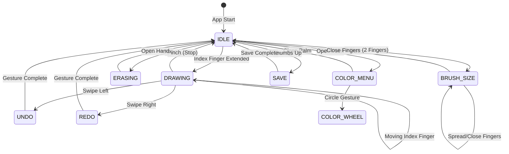

## 6.3 Gesture Filtering & Stabilization

```csharp
// GestureStabilizer.cs
public class GestureStabilizer
{
    private const int HISTORY_SIZE = 5;
    private Queue<GestureType> gestureHistory = new();
    private GestureType currentStableGesture = GestureType.NONE;
    
    // Debounce - Prevents rapid gesture switching
    private float lastGestureChangeTime;
    private const float DEBOUNCE_TIME = 0.15f; // 150ms
    
    // One Euro Filter for landmark smoothing
    private OneEuroFilter[] landmarkFilters = new OneEuroFilter[21];
    
    public GestureType Stabilize(GestureType rawGesture)
    {
        gestureHistory.Enqueue(rawGesture);
        if (gestureHistory.Count > HISTORY_SIZE)
            gestureHistory.Dequeue();
        
        // Majority voting
        var counts = gestureHistory.GroupBy(g => g)
                                   .OrderByDescending(g => g.Count())
                                   .First();
        
        if (counts.Count() >= HISTORY_SIZE * 0.6f && // 60% agreement
            Time.time - lastGestureChangeTime > DEBOUNCE_TIME)
        {
            if (counts.Key != currentStableGesture)
            {
                currentStableGesture = counts.Key;
                lastGestureChangeTime = Time.time;
            }
        }
        
        return currentStableGesture;
    }
}

// One Euro Filter for smooth landmark tracking
public class OneEuroFilter
{
    private float minCutoff;
    private float beta;
    private float dCutoff;
    private float xPrev, dxPrev;
    private float tPrev;
    private bool initialized;

    public OneEuroFilter(float minCutoff = 1.0f, float beta = 0.007f, float dCutoff = 1.0f)
    {
        this.minCutoff = minCutoff;
        this.beta = beta;
        this.dCutoff = dCutoff;
    }

    public float Filter(float x, float timestamp)
    {
        if (!initialized)
        {
            xPrev = x;
            dxPrev = 0;
            tPrev = timestamp;
            initialized = true;
            return x;
        }

        float dt = timestamp - tPrev;
        if (dt <= 0) dt = 1f / 60f;

        float dx = (x - xPrev) / dt;
        float edx = LowPassFilter(dx, dxPrev, Alpha(dCutoff, dt));
        float cutoff = minCutoff + beta * Mathf.Abs(edx);
        float result = LowPassFilter(x, xPrev, Alpha(cutoff, dt));

        xPrev = result;
        dxPrev = edx;
        tPrev = timestamp;

        return result;
    }

    private float Alpha(float cutoff, float dt) => 
        1.0f / (1.0f + 1.0f / (2.0f * Mathf.PI * cutoff * dt));

    private float LowPassFilter(float x, float prev, float alpha) => 
        alpha * x + (1 - alpha) * prev;
}
```

## 6.4 Gesture Customization & Sensitivity Settings

```csharp
[System.Serializable]
public class GestureSettings
{
    [Range(0.01f, 0.15f)] public float pinchThreshold = 0.05f;
    [Range(0.1f, 5.0f)]  public float swipeSpeedThreshold = 2.0f;
    [Range(0.05f, 0.5f)]  public float debounceDuration = 0.15f;
    [Range(10, 60)]        public int circleMinPoints = 20;
    [Range(0.5f, 0.9f)]   public float detectionConfidence = 0.7f;
    [Range(0.3f, 0.9f)]   public float trackingConfidence = 0.5f;
    public bool leftHandMode = false;
    public bool twoHandMode = false;
}
```

---

# 7. DRAWING ENGINE

## 7.1 Stroke Rendering Architecture

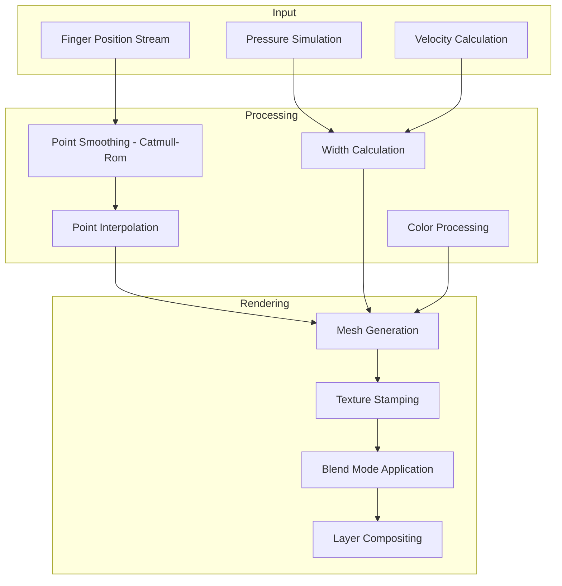

## 7.2 Core Drawing Classes

```csharp
// StrokePoint.cs
[System.Serializable]
public struct StrokePoint
{
    public Vector2 position;      // Screen space position
    public float pressure;        // Simulated pressure (0-1)
    public float tilt;            // Brush tilt angle
    public float timestamp;       // Time of capture
    public float velocity;        // Hand movement speed
    public Color color;           // Point color
    public float width;           // Calculated brush width
}

// Stroke.cs
[System.Serializable]
public class Stroke
{
    public string id;
    public List<StrokePoint> points = new();
    public BrushSettings brush;
    public BlendMode blendMode;
    public int layerIndex;
    public float opacity = 1f;
    
    // Bounding box for spatial optimization
    public Rect bounds;
    
    public void AddPoint(StrokePoint point)
    {
        points.Add(point);
        UpdateBounds(point.position);
    }
    
    private void UpdateBounds(Vector2 pos)
    {
        if (points.Count == 1)
        {
            bounds = new Rect(pos.x, pos.y, 0, 0);
        }
        else
        {
            bounds = Rect.MinMaxRect(
                Mathf.Min(bounds.xMin, pos.x),
                Mathf.Min(bounds.yMin, pos.y),
                Mathf.Max(bounds.xMax, pos.x),
                Mathf.Max(bounds.yMax, pos.y)
            );
        }
    }
}

// DrawingEngine.cs
public class DrawingEngine : MonoBehaviour
{
    [Header("Configuration")]
    public int maxStrokesPerLayer = 1000;
    public int maxPointsPerStroke = 10000;
    public float minPointDistance = 2f; // Minimum pixel distance between points
    
    [Header("Smoothing")]
    public int smoothingWindowSize = 5;
    public float catmullRomTension = 0.5f;
    
    private List<Stroke> allStrokes = new();
    private Stroke currentStroke;
    private RenderTexture canvasTexture;
    
    // --- Catmull-Rom Spline Interpolation ---
    
    public Vector2 CatmullRomPoint(Vector2 p0, Vector2 p1, Vector2 p2, Vector2 p3, float t)
    {
        float t2 = t * t;
        float t3 = t2 * t;
        
        return 0.5f * (
            (2f * p1) +
            (-p0 + p2) * t +
            (2f * p0 - 5f * p1 + 4f * p2 - p3) * t2 +
            (-p0 + 3f * p1 - 3f * p2 + p3) * t3
        );
    }
    
    public List<Vector2> InterpolateStroke(List<StrokePoint> points, int segmentsPerCurve = 8)
    {
        var result = new List<Vector2>();
        
        for (int i = 0; i < points.Count - 1; i++)
        {
            Vector2 p0 = (i > 0) ? points[i - 1].position : points[i].position;
            Vector2 p1 = points[i].position;
            Vector2 p2 = points[i + 1].position;
            Vector2 p3 = (i < points.Count - 2) ? points[i + 2].position : points[i + 1].position;
            
            for (int j = 0; j < segmentsPerCurve; j++)
            {
                float t = j / (float)segmentsPerCurve;
                result.Add(CatmullRomPoint(p0, p1, p2, p3, t));
            }
        }
        
        return result;
    }
    
    // --- Pressure Simulation ---
    
    public float SimulatePressure(float velocity, float previousPressure)
    {
        // Slower movement = more pressure (heavier stroke)
        float targetPressure = Mathf.Clamp01(1f - velocity / 10f);
        
        // Smooth pressure transitions
        return Mathf.Lerp(previousPressure, targetPressure, 0.3f);
    }
}
```

## 7.3 Mesh-Based Stroke Rendering

```csharp
// StrokeMeshBuilder.cs
public class StrokeMeshBuilder
{
    public Mesh BuildStrokeMesh(List<StrokePoint> points, BrushSettings brush)
    {
        if (points.Count < 2) return null;
        
        var vertices = new List<Vector3>();
        var uvs = new List<Vector2>();
        var triangles = new List<int>();
        var colors = new List<Color>();
        
        float totalLength = 0;
        
        for (int i = 0; i < points.Count; i++)
        {
            if (i > 0)
                totalLength += Vector2.Distance(points[i].position, points[i - 1].position);
            
            // Calculate perpendicular direction
            Vector2 dir;
            if (i == 0)
                dir = (points[1].position - points[0].position).normalized;
            else if (i == points.Count - 1)
                dir = (points[i].position - points[i - 1].position).normalized;
            else
                dir = (points[i + 1].position - points[i - 1].position).normalized;
            
            Vector2 perp = new Vector2(-dir.y, dir.x);
            float halfWidth = points[i].width * points[i].pressure * 0.5f;
            
            // Taper at start and end
            float taper = 1f;
            if (i < 5) taper = i / 5f;
            if (i > points.Count - 5) taper = (points.Count - 1 - i) / 5f;
            halfWidth *= taper;
            
            Vector2 pos = points[i].position;
            vertices.Add(pos + perp * halfWidth);
            vertices.Add(pos - perp * halfWidth);
            
            float u = totalLength / (brush.textureScale * 100f);
            uvs.Add(new Vector2(u, 0));
            uvs.Add(new Vector2(u, 1));
            
            Color c = points[i].color;
            c.a *= points[i].pressure;
            colors.Add(c);
            colors.Add(c);
            
            if (i > 0)
            {
                int idx = (i - 1) * 2;
                triangles.AddRange(new[] { idx, idx + 1, idx + 2, idx + 1, idx + 3, idx + 2 });
            }
        }
        
        Mesh mesh = new Mesh();
        mesh.vertices = vertices.ToArray().Select(v => (Vector3)v).ToArray();
        mesh.uv = uvs.ToArray();
        mesh.triangles = triangles.ToArray();
        mesh.colors = colors.ToArray();
        mesh.RecalculateNormals();
        
        return mesh;
    }
}
```

## 7.4 Undo/Redo System (Command Pattern)

```csharp
// ICommand.cs
public interface ICommand
{
    void Execute();
    void Undo();
    string Description { get; }
}

// DrawStrokeCommand.cs
public class DrawStrokeCommand : ICommand
{
    private Stroke stroke;
    private LayerManager layerManager;
    
    public string Description => "Draw Stroke";
    
    public DrawStrokeCommand(Stroke stroke, LayerManager layerManager)
    {
        this.stroke = stroke;
        this.layerManager = layerManager;
    }
    
    public void Execute() => layerManager.AddStrokeToLayer(stroke, stroke.layerIndex);
    public void Undo() => layerManager.RemoveStrokeFromLayer(stroke, stroke.layerIndex);
}

// CommandHistory.cs
public class CommandHistory
{
    private Stack<ICommand> undoStack = new();
    private Stack<ICommand> redoStack = new();
    private int maxHistorySize = 100;
    
    public event Action OnHistoryChanged;
    
    public void ExecuteCommand(ICommand command)
    {
        command.Execute();
        undoStack.Push(command);
        redoStack.Clear();
        
        // Trim history if too large
        if (undoStack.Count > maxHistorySize)
        {
            var temp = undoStack.ToArray();
            undoStack.Clear();
            for (int i = 0; i < maxHistorySize; i++)
                undoStack.Push(temp[i]);
        }
        
        OnHistoryChanged?.Invoke();
    }
    
    public bool Undo()
    {
        if (undoStack.Count == 0) return false;
        var command = undoStack.Pop();
        command.Undo();
        redoStack.Push(command);
        OnHistoryChanged?.Invoke();
        return true;
    }
    
    public bool Redo()
    {
        if (redoStack.Count == 0) return false;
        var command = redoStack.Pop();
        command.Execute();
        undoStack.Push(command);
        OnHistoryChanged?.Invoke();
        return true;
    }
    
    public bool CanUndo => undoStack.Count > 0;
    public bool CanRedo => redoStack.Count > 0;
}
```

---

# 8. BRUSH & COLOR SYSTEM

## 8.1 Brush Architecture

```csharp
// BrushSettings.cs
[CreateAssetMenu(fileName = "NewBrush", menuName = "AirPainter/Brush")]
public class BrushSettings : ScriptableObject
{
    [Header("Identity")]
    public string brushId;
    public string brushName;
    public Sprite icon;
    public BrushCategory category;
    public bool isPremium = false;
    
    [Header("Appearance")]
    public Texture2D brushTexture;      // Brush tip texture
    public Texture2D grainTexture;      // Paper grain overlay
    public float defaultSize = 10f;
    [Range(0f, 1f)] public float opacity = 1f;
    [Range(0f, 1f)] public float flow = 0.8f;
    
    [Header("Dynamics")]
    public float minSize = 1f;
    public float maxSize = 100f;
    public AnimationCurve pressureSizeCurve;
    public AnimationCurve pressureOpacityCurve;
    public AnimationCurve velocityEffectCurve;
    
    [Header("Behavior")]
    public float spacing = 0.25f;        // Distance between stamps (ratio of size)
    public float scatterAmount = 0f;     // Random position offset
    public float rotationJitter = 0f;    // Random rotation variation
    public float sizeJitter = 0f;        // Random size variation
    public bool useTextureMasking = false;
    
    [Header("Blend")]
    public BlendMode blendMode = BlendMode.Normal;
    public bool enableWetMixing = false; // For watercolor effect
    public float wetness = 0f;
}

public enum BrushCategory
{
    Basic,        // Pencil, Pen, Marker
    Artistic,     // Oil Brush, Watercolor, Pastel
    Special,      // Spray, Neon, Glow
    Pattern,      // Stamp, Pattern, Custom
    Eraser        // Hard Eraser, Soft Eraser
}

public enum BlendMode
{
    Normal,
    Multiply,
    Screen,
    Overlay,
    SoftLight,
    HardLight,
    Difference,
    Add,
    Subtract
}
```

### 8.2 Default Brush Library

| Brush Name | Category | Premium | Description |
|------------|----------|---------|-------------|
| Pencil HB | Basic | ❌ | Standard graphite pencil |
| Pencil 2B | Basic | ❌ | Soft dark pencil |
| Fine Pen | Basic | ❌ | Thin precise pen |
| Bold Marker | Basic | ❌ | Thick marker |
| Calligraphy | Basic | ✅ | Variable-width calligraphy pen |
| Oil Brush Round | Artistic | ❌ | Round oil painting brush |
| Oil Brush Flat | Artistic | ✅ | Flat oil painting brush |
| Watercolor Wash | Artistic | ✅ | Wet watercolor with bleeding |
| Watercolor Dry | Artistic | ✅ | Dry watercolor brush |
| Pastel Soft | Artistic | ✅ | Soft pastel chalk |
| Charcoal | Artistic | ❌ | Rough charcoal texture |
| Spray Paint | Special | ❌ | Spray can effect |
| Neon Glow | Special | ✅ | Glowing neon line |
| Pixel Brush | Special | ✅ | Pixel art brush |
| Glitter | Special | ✅ | Sparkle particle brush |
| Rainbow | Special | ❌ | Auto-cycling rainbow colors |
| Stamp Circle | Pattern | ❌ | Circle stamp |
| Stamp Star | Pattern | ✅ | Star stamp |
| Custom Pattern | Pattern | ✅ | User-uploaded pattern |
| Hard Eraser | Eraser | ❌ | Clean sharp eraser |
| Soft Eraser | Eraser | ❌ | Feathered edge eraser |

## 8.3 Color System

```csharp
// ColorSystem.cs
public class ColorSystem : MonoBehaviour
{
    [Header("Color State")]
    public Color primaryColor = Color.black;
    public Color secondaryColor = Color.white;
    
    [Header("History")]
    public List<Color> recentColors = new(20);
    public List<Color> favoriteColors = new(50);
    
    [Header("Palette Presets")]
    public ColorPalette[] presetPalettes;
    
    // Events
    public event Action<Color> OnPrimaryColorChanged;
    public event Action<Color> OnSecondaryColorChanged;
    
    // HSV Color Wheel
    public Color ColorFromWheel(float angle, float distance)
    {
        float hue = angle / 360f;
        float saturation = distance; // 0 = center (white), 1 = edge (full saturation)
        float value = 1f;
        return Color.HSVToRGB(hue, saturation, value);
    }
    
    // Color Picker Modes
    public enum PickerMode
    {
        Wheel,      // HSV Color Wheel
        Slider,     // RGB/HSV Sliders
        Palette,    // Preset palettes
        Eyedropper, // Pick from canvas
        Hex         // Hex code input
    }
}

[System.Serializable]
public class ColorPalette
{
    public string name;
    public bool isPremium;
    public Color[] colors;
}
```

### Default Color Palettes

| Palette Name | Colors | Premium |
|-------------|--------|---------|
| Basic | 12 primary + secondary colors | ❌ |
| Pastel | 24 soft pastel shades | ❌ |
| Neon | 16 vibrant neon colors | ❌ |
| Earth Tones | 20 natural earth colors | ✅ |
| Skin Tones | 30 diverse skin tone shades | ✅ |
| Vintage | 18 retro/vintage colors | ✅ |
| Ocean | 20 blue/teal ocean shades | ✅ |
| Sunset | 16 warm sunset gradients | ✅ |
| Monochrome | 20 grayscale shades | ❌ |
| Custom | User-created palettes | ✅ |

---

# 9. LAYER SYSTEM

## 9.1 Layer Architecture

```csharp
// Layer.cs
[System.Serializable]
public class Layer
{
    public string id;
    public string name;
    public int order;                     // Z-order
    public bool isVisible = true;
    public bool isLocked = false;
    [Range(0f, 1f)] public float opacity = 1f;
    public BlendMode blendMode = BlendMode.Normal;
    public RenderTexture renderTexture;   // Layer's render target
    public List<Stroke> strokes = new();
    
    // Clipping / Masking
    public bool isClippingMask = false;
    public string clippedToLayerId;
}

// LayerManager.cs
public class LayerManager : MonoBehaviour
{
    public int maxLayers = 20;            // Free: 5, Premium: 20
    public int maxLayersFree = 5;
    public List<Layer> layers = new();
    public int activeLayerIndex = 0;
    
    public event Action OnLayersChanged;
    public event Action<int> OnActiveLayerChanged;
    
    public Layer ActiveLayer => layers[activeLayerIndex];
    
    public Layer CreateLayer(string name = null)
    {
        if (layers.Count >= maxLayers)
            throw new InvalidOperationException("Maximum layers reached");
        
        var layer = new Layer
        {
            id = System.Guid.NewGuid().ToString(),
            name = name ?? $"Layer {layers.Count + 1}",
            order = layers.Count,
            renderTexture = new RenderTexture(
                Screen.width, Screen.height, 0, RenderTextureFormat.ARGB32
            )
        };
        
        layers.Add(layer);
        OnLayersChanged?.Invoke();
        return layer;
    }
    
    public void MergeDown(int layerIndex)
    {
        if (layerIndex <= 0 || layerIndex >= layers.Count) return;
        
        // Composite upper layer onto lower layer
        var upper = layers[layerIndex];
        var lower = layers[layerIndex - 1];
        
        Graphics.Blit(upper.renderTexture, lower.renderTexture, compositeMaterial);
        
        layers.RemoveAt(layerIndex);
        activeLayerIndex = Mathf.Min(activeLayerIndex, layers.Count - 1);
        OnLayersChanged?.Invoke();
    }
    
    public RenderTexture CompositeAllLayers()
    {
        var composite = RenderTexture.GetTemporary(Screen.width, Screen.height, 0);
        RenderTexture.active = composite;
        GL.Clear(true, true, Color.clear);
        
        foreach (var layer in layers.OrderBy(l => l.order))
        {
            if (!layer.isVisible) continue;
            
            compositeMaterial.SetFloat("_Opacity", layer.opacity);
            compositeMaterial.SetInt("_BlendMode", (int)layer.blendMode);
            Graphics.Blit(layer.renderTexture, composite, compositeMaterial);
        }
        
        return composite;
    }
}
```

## 9.2 Layer Operations

| Operation | Free Users | Premium Users |
|-----------|-----------|--------------|
| Max Layers | 5 | 20 |
| Add Layer | ✅ | ✅ |
| Delete Layer | ✅ | ✅ |
| Reorder Layers | ✅ | ✅ |
| Rename Layer | ✅ | ✅ |
| Toggle Visibility | ✅ | ✅ |
| Opacity Control | ✅ | ✅ |
| Blend Modes | Normal only | All modes |
| Lock Layer | ❌ | ✅ |
| Merge Down | ❌ | ✅ |
| Duplicate Layer | ❌ | ✅ |
| Clipping Masks | ❌ | ✅ |
| Layer Groups | ❌ | ✅ |

---

# 10. AI FEATURES MODULE

## 10.1 AI Architecture Overview

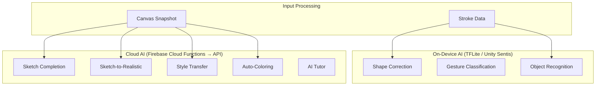

## 10.2 AI Feature Specifications

### 10.2.1 Smart Shape Correction (On-Device)

**Purpose**: Automatically corrects freehand shapes into clean geometric forms.

```csharp
// ShapeCorrector.cs
public class ShapeCorrector
{
    public enum ShapeType
    {
        Line, Circle, Ellipse, Rectangle, Triangle,
        Pentagon, Star, Arrow, Heart, Unknown
    }
    
    public ShapeType DetectShape(List<StrokePoint> points)
    {
        // 1. Calculate basic metrics
        float totalLength = CalculatePathLength(points);
        Rect bounds = CalculateBounds(points);
        float aspectRatio = bounds.width / bounds.height;
        
        // 2. Check linearity
        if (IsLinear(points, tolerance: 0.05f))
            return ShapeType.Line;
        
        // 3. Check circularity
        float circularity = CalculateCircularity(points);
        if (circularity > 0.85f)
            return aspectRatio > 0.8f && aspectRatio < 1.2f 
                ? ShapeType.Circle : ShapeType.Ellipse;
        
        // 4. Detect corners using Douglas-Peucker
        var simplified = DouglasPeucker(points, epsilon: 5f);
        int corners = simplified.Count - 1;
        
        switch (corners)
        {
            case 3: return ShapeType.Triangle;
            case 4: return IsRectangular(simplified) ? ShapeType.Rectangle : ShapeType.Unknown;
            case 5: return ShapeType.Pentagon;
            case 10: return ShapeType.Star;
            default: return ShapeType.Unknown;
        }
    }
    
    public List<StrokePoint> CorrectToShape(List<StrokePoint> points, ShapeType shape)
    {
        switch (shape)
        {
            case ShapeType.Circle:
                return GenerateCirclePoints(CalculateCenter(points), CalculateAvgRadius(points));
            case ShapeType.Rectangle:
                return GenerateRectanglePoints(CalculateBounds(points));
            case ShapeType.Line:
                return new List<StrokePoint> { points[0], points[^1] };
            // ... other shapes
        }
        return points; // No correction for unknown
    }
}
```

### 10.2.2 Sketch Completion (Cloud AI)

**Purpose**: AI completes partial/unfinished sketches.

| Specification | Value |
|---------------|-------|
| Model | Stable Diffusion XL (img2img) or custom pix2pix |
| Input | Canvas snapshot (PNG, max 1024×1024) |
| Output | Completed sketch (PNG) |
| Latency Target | < 5 seconds |
| API Endpoint | `/api/v1/ai/sketch-complete` |
| Cost | 1 AI Credit per use |

### 10.2.3 Sketch-to-Realistic (Cloud AI)

**Purpose**: Converts line drawings into realistic photographic images.

| Specification | Value |
|---------------|-------|
| Model | ControlNet + Stable Diffusion XL |
| Input | Sketch image + optional text prompt |
| Output | Realistic image (PNG, 1024×1024) |
| Latency Target | < 10 seconds |
| API Endpoint | `/api/v1/ai/sketch-to-realistic` |
| Cost | 2 AI Credits per use |

### 10.2.4 Style Transfer (Cloud AI)

**Purpose**: Apply artistic styles to drawings.

**Available Styles**:

| Style | Description | Premium |
|-------|-------------|---------|
| Anime/Manga | Japanese anime art style | ❌ |
| Oil Painting | Classical oil paint texture | ✅ |
| Watercolor | Soft watercolor effect | ✅ |
| Pixel Art | Retro pixel art style | ❌ |
| Pop Art | Bold pop art colors | ✅ |
| Impressionist | Monet-style impressionism | ✅ |
| Sketch | Pencil sketch effect | ❌ |
| Cyberpunk | Futuristic neon style | ✅ |
| Ukiyo-e | Japanese woodblock print | ✅ |
| Van Gogh | Starry Night swirl style | ✅ |

### 10.2.5 Auto-Coloring (Cloud AI)

**Purpose**: Automatically colorizes black-and-white sketches.

```csharp
// AIColorizer.cs
public class AIColorizer
{
    public async Task<Texture2D> AutoColor(Texture2D sketch, string styleHint = "")
    {
        byte[] imageData = sketch.EncodeToPNG();
        string base64 = Convert.ToBase64String(imageData);
        
        var request = new AIRequest
        {
            image = base64,
            model = "auto-colorize-v2",
            parameters = new
            {
                style = styleHint, // "anime", "realistic", "pastel"
                saturation = 0.8f,
                temperature = "warm"
            }
        };
        
        var response = await CloudFunctionClient.Call("ai-colorize", request);
        return DecodeResponse(response);
    }
}
```

### 10.2.6 Object Recognition (On-Device)

**Purpose**: Identifies what the user is drawing and offers suggestions.

```csharp
// ObjectRecognizer.cs
public class ObjectRecognizer
{
    private Interpreter tfliteModel;
    private string[] labels; // ["cat", "dog", "house", "tree", "car", ...]
    
    public RecognitionResult Recognize(Texture2D canvasSnapshot)
    {
        // Preprocess: resize to 28x28, grayscale, normalize
        var input = Preprocess(canvasSnapshot);
        
        // Run TFLite inference
        tfliteModel.Run(input);
        float[] output = tfliteModel.GetOutput();
        
        // Get top-3 predictions
        var predictions = output
            .Select((score, idx) => (label: labels[idx], score))
            .OrderByDescending(p => p.score)
            .Take(3)
            .ToList();
        
        return new RecognitionResult
        {
            topPrediction = predictions[0].label,
            confidence = predictions[0].score,
            alternatives = predictions.Skip(1).ToList()
        };
    }
}
```

### 10.2.7 AI Tutor (Cloud)

**Purpose**: Step-by-step drawing guidance for beginners.

| Feature | Description |
|---------|-------------|
| Step-by-Step Guides | Break complex drawings into simple steps |
| Ghost Lines | Show faint guide lines for user to trace |
| Progress Tracking | Track improvement over time |
| Difficulty Levels | Beginner → Intermediate → Advanced |
| Categories | Animals, Faces, Landscapes, Objects, Anime |
| Feedback | Real-time comparison with reference |

## 10.3 AI Credit System

| Tier | Credits/Month | Price |
|------|---------------|-------|
| Free | 10 credits | $0 |
| Basic | 100 credits | Included in Premium |
| Pro | 500 credits | $9.99/mo add-on |
| Unlimited | ∞ | $19.99/mo add-on |

| AI Feature | Credit Cost |
|------------|-------------|
| Shape Correction | 0 (on-device) |
| Object Recognition | 0 (on-device) |
| Sketch Completion | 1 credit |
| Style Transfer | 2 credits |
| Sketch-to-Realistic | 2 credits |
| Auto-Coloring | 1 credit |
| AI Tutor Session | 0 (included) |

---

# 11. AR MODE

## 11.1 AR Feature Set

### 11.1.1 AR Wall Painting

```csharp
// ARWallPainter.cs
public class ARWallPainter : MonoBehaviour
{
    [Header("AR References")]
    public ARSessionOrigin arSession;
    public ARRaycastManager raycastManager;
    public ARPlaneManager planeManager;
    
    [Header("Painting")]
    public Material arPaintMaterial;
    public float paintScale = 1f;
    
    private List<ARRaycastHit> hits = new();
    
    public void PaintOnWall(Vector2 screenPoint, Color color, float brushSize)
    {
        if (raycastManager.Raycast(screenPoint, hits, TrackableType.PlaneWithinPolygon))
        {
            Pose hitPose = hits[0].pose;
            
            // Create paint decal on detected surface
            var decal = new PaintDecal
            {
                position = hitPose.position,
                rotation = hitPose.rotation,
                color = color,
                size = brushSize * paintScale,
                texture = currentBrush.brushTexture
            };
            
            ApplyDecalToSurface(decal);
        }
    }
}
```

### 11.1.2 3D Air Painting

```csharp
// AirPainter3D.cs
public class AirPainter3D : MonoBehaviour
{
    [Header("3D Painting")]
    public LineRenderer lineRendererPrefab;
    public float strokeWidth3D = 0.01f; // meters
    
    private List<LineRenderer> activeStrokes = new();
    private LineRenderer currentStroke;
    
    public void StartStroke3D(Vector3 worldPosition, Color color)
    {
        currentStroke = Instantiate(lineRendererPrefab);
        currentStroke.startColor = color;
        currentStroke.endColor = color;
        currentStroke.startWidth = strokeWidth3D;
        currentStroke.endWidth = strokeWidth3D;
        currentStroke.positionCount = 1;
        currentStroke.SetPosition(0, worldPosition);
    }
    
    public void AddPoint3D(Vector3 worldPosition)
    {
        if (currentStroke == null) return;
        
        currentStroke.positionCount++;
        currentStroke.SetPosition(currentStroke.positionCount - 1, worldPosition);
    }
    
    public Vector3 FingerToWorldPosition(Vector2 fingerScreenPos, float depth = 0.5f)
    {
        // Convert finger screen position to 3D world position
        // using AR camera and a fixed depth from camera
        Camera arCamera = arSession.camera;
        Vector3 screenPos = new Vector3(fingerScreenPos.x, fingerScreenPos.y, depth);
        return arCamera.ScreenToWorldPoint(screenPos);
    }
}
```

## 11.2 AR Specifications

| Feature | Specification |
|---------|---------------|
| Plane Detection | Horizontal + Vertical surfaces |
| Surface Types | Walls, floors, tables |
| Paint Persistence | Session-based (reset on exit) |
| Max Paint Decals | 500 per session |
| 3D Stroke Depth | 0.3m - 3.0m from camera |
| Light Estimation | Automatic ambient light matching |
| Occlusion | People occlusion on supported devices |
| Scale | Real-world scale (1:1) |
| Photo Capture | AR scene capture with painting overlay |

---

# 12. MULTIPLAYER SYSTEM

## 12.1 Architecture

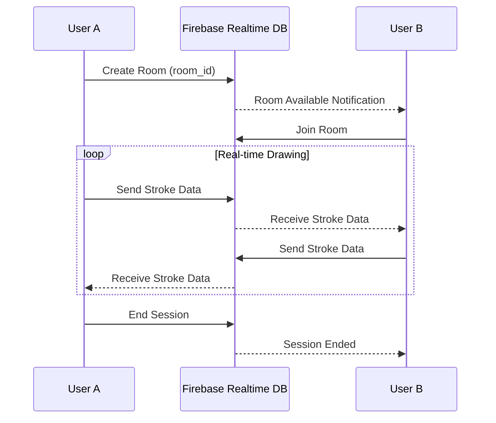

## 12.2 Room & Session Data

```csharp
// MultiplayerRoom.cs
[System.Serializable]
public class MultiplayerRoom
{
    public string roomId;
    public string hostUserId;
    public string roomName;
    public string roomCode;          // 6-character join code
    public int maxPlayers = 4;
    public List<string> playerIds;
    public RoomState state;          // Waiting, InProgress, Completed
    public long createdAt;
    public long lastActivity;
    public CanvasSettings canvasSettings;
}

// NetworkStrokeData.cs - Optimized for real-time sync
[System.Serializable]
public class NetworkStrokeData
{
    public string strokeId;
    public string userId;
    public string userName;
    public Color32 color;            // Compact color
    public float brushSize;
    public string brushId;
    public int layerIndex;
    public List<CompressedPoint> points;
    public long timestamp;
}

[System.Serializable]
public struct CompressedPoint
{
    public short x;  // Screen position × 10 (0-19200)
    public short y;  
    public byte pressure;  // 0-255
}
```

## 12.3 Multiplayer Specifications

| Feature | Specification |
|---------|---------------|
| Max Players per Room | 4 |
| Sync Protocol | Firebase Realtime Database |
| Sync Rate | 20 updates/second per user |
| Data Compression | Delta encoding + quantization |
| Latency Target | < 200ms end-to-end |
| Room Lifetime | 2 hours max |
| Voice Chat | WebRTC (optional premium feature) |
| Shared Canvas | Real-time synchronized |
| Player Colors | Auto-assigned distinct colors |
| Spectator Mode | View-only joining |

---

# 13. VOICE COMMAND SYSTEM

## 13.1 Architecture

```csharp
// VoiceCommandManager.cs
public class VoiceCommandManager : MonoBehaviour
{
    [Header("Configuration")]
    public string language = "en-US";
    public float listenTimeout = 5f;
    public bool continuousListening = false; // Wake word mode
    public string wakeWord = "Hey Painter";
    
    // Platform-specific speech recognition
    private ISpeechRecognizer recognizer;
    
    void Awake()
    {
        #if UNITY_ANDROID
        recognizer = new AndroidSpeechRecognizer();
        #elif UNITY_IOS
        recognizer = new iOSSpeechRecognizer();
        #endif
    }
    
    private Dictionary<string, Action> voiceCommands = new()
    {
        // Drawing Commands
        { "start drawing", () => SetMode(DrawMode.Draw) },
        { "stop drawing", () => SetMode(DrawMode.Idle) },
        { "eraser", () => SetMode(DrawMode.Erase) },
        { "undo", () => CommandHistory.Undo() },
        { "redo", () => CommandHistory.Redo() },
        
        // Color Commands
        { "red", () => SetColor(Color.red) },
        { "blue", () => SetColor(Color.blue) },
        { "green", () => SetColor(Color.green) },
        { "black", () => SetColor(Color.black) },
        { "white", () => SetColor(Color.white) },
        { "yellow", () => SetColor(Color.yellow) },
        
        // Brush Commands
        { "pencil", () => SetBrush("pencil_hb") },
        { "pen", () => SetBrush("fine_pen") },
        { "marker", () => SetBrush("bold_marker") },
        { "spray", () => SetBrush("spray_paint") },
        { "bigger brush", () => AdjustBrushSize(+5) },
        { "smaller brush", () => AdjustBrushSize(-5) },
        
        // Layer Commands
        { "new layer", () => CreateNewLayer() },
        { "next layer", () => SwitchLayer(+1) },
        { "previous layer", () => SwitchLayer(-1) },
        { "hide layer", () => ToggleLayerVisibility() },
        
        // File Commands
        { "save", () => SaveProject() },
        { "save as", () => SaveProjectAs() },
        { "open gallery", () => OpenGallery() },
        
        // View Commands
        { "zoom in", () => ZoomCanvas(1.2f) },
        { "zoom out", () => ZoomCanvas(0.8f) },
        { "reset view", () => ResetCanvasView() },
        { "clear canvas", () => ConfirmClearCanvas() },
        
        // AI Commands
        { "ai complete", () => AISketchComplete() },
        { "ai color", () => AIAutoColor() },
        { "ai style", () => OpenStyleTransferMenu() },
        
        // AR Commands
        { "ar mode", () => ToggleARMode() },
        { "take photo", () => CaptureARPhoto() },
    };
}
```

## 13.2 Supported Languages

| Language | Code | Status |
|----------|------|--------|
| English | en-US | ✅ Launch |
| Hindi | hi-IN | ✅ Launch |
| Spanish | es-ES | 🔄 Post-launch |
| Japanese | ja-JP | 🔄 Post-launch |
| Korean | ko-KR | 🔄 Post-launch |

---

# 14. SAVE/LOAD & GALLERY

## 14.1 Project File Format

```csharp
// ProjectFile.cs
[System.Serializable]
public class AirPainterProject
{
    // Metadata
    public string projectId;
    public string projectName;
    public string authorId;
    public int version = 1;
    public long createdAt;
    public long modifiedAt;
    
    // Canvas
    public Vector2Int canvasSize;
    public Color backgroundColor;
    
    // Layers
    public List<SerializedLayer> layers;
    
    // Strokes (per layer)
    public List<SerializedStroke> strokes;
    
    // Settings
    public ProjectSettings settings;
    
    // Thumbnail
    public byte[] thumbnailPNG;  // 256x256 preview
}

// File extension: .airpaint
// Storage format: JSON + Binary (strokes compressed with LZ4)
// Max file size: 50 MB (local), 25 MB (cloud sync)
```

## 14.2 Gallery System

```csharp
// GalleryManager.cs
public class GalleryManager : MonoBehaviour
{
    public enum GalleryView { Grid, List, Timeline }
    public enum SortOrder { DateDesc, DateAsc, NameAsc, NameDesc, SizeDesc }
    
    public List<ProjectThumbnail> LoadGallery(
        GalleryView view = GalleryView.Grid,
        SortOrder sort = SortOrder.DateDesc,
        string searchQuery = "",
        string[] tags = null
    )
    {
        // Load from local SQLite + merge with cloud projects
        var localProjects = LocalDB.GetAllProjects();
        var cloudProjects = CloudSync.GetProjectList();
        
        return MergeAndSort(localProjects, cloudProjects, sort, searchQuery, tags);
    }
    
    // Gallery Operations
    public void ExportAs(string projectId, ExportFormat format)
    {
        // PNG, JPEG, SVG (vector), PSD (layers), GIF (animation), Video
    }
    
    public void ShareToSocial(string projectId, SocialPlatform platform)
    {
        // Instagram, Twitter, TikTok, WhatsApp
    }
}

public enum ExportFormat
{
    PNG,       // Raster, transparent background option
    JPEG,      // Raster, quality setting
    SVG,       // Vector (from stroke data)
    PSD,       // Photoshop compatible with layers
    GIF,       // Animated recording
    MP4,       // Time-lapse video
    AIRPAINT   // Native project format
}
```

## 14.3 Cloud Sync

| Feature | Free | Premium |
|---------|------|---------|
| Local Projects | Unlimited | Unlimited |
| Cloud Projects | 5 | 100 |
| Cloud Storage | 100 MB | 5 GB |
| Auto-Sync | ❌ | ✅ |
| Version History | ❌ | Last 10 versions |
| Cross-Device Sync | ❌ | ✅ |

---

# 15. UI/UX DESIGN SYSTEM

## 15.1 Design Philosophy

### Glassmorphism Design Language

```
Design Tokens:
  
  // Colors
  --bg-primary: rgba(17, 17, 27, 0.95)         // Deep dark background
  --bg-secondary: rgba(30, 30, 50, 0.85)        // Panel background
  --glass-bg: rgba(255, 255, 255, 0.08)          // Glass effect
  --glass-border: rgba(255, 255, 255, 0.15)      // Glass border
  --glass-blur: 20px                             // Backdrop blur
  
  --accent-primary: #7C3AED                      // Purple accent
  --accent-secondary: #06B6D4                    // Cyan accent  
  --accent-gradient: linear(135deg, #7C3AED, #06B6D4)
  
  --text-primary: rgba(255, 255, 255, 0.95)
  --text-secondary: rgba(255, 255, 255, 0.6)
  --text-disabled: rgba(255, 255, 255, 0.3)
  
  // Spacing
  --space-xs: 4px
  --space-sm: 8px
  --space-md: 16px
  --space-lg: 24px
  --space-xl: 32px
  
  // Typography (using Google Fonts: Inter)
  --font-heading: Inter Bold, 24px
  --font-subheading: Inter SemiBold, 18px
  --font-body: Inter Regular, 14px
  --font-caption: Inter Regular, 12px
  
  // Corners
  --radius-sm: 8px
  --radius-md: 12px
  --radius-lg: 16px
  --radius-xl: 24px
  --radius-full: 9999px
  
  // Shadows
  --shadow-sm: 0 2px 8px rgba(0, 0, 0, 0.3)
  --shadow-md: 0 4px 16px rgba(0, 0, 0, 0.4)
  --shadow-lg: 0 8px 32px rgba(0, 0, 0, 0.5)
  --shadow-glow: 0 0 20px rgba(124, 58, 237, 0.3)
```

### Unity UI Implementation

```csharp
// GlassmorphismPanel.cs
[RequireComponent(typeof(CanvasRenderer))]
public class GlassmorphismPanel : MonoBehaviour
{
    [Header("Glass Properties")]
    public float blurAmount = 20f;
    public Color tintColor = new Color(1, 1, 1, 0.08f);
    public float borderWidth = 1f;
    public Color borderColor = new Color(1, 1, 1, 0.15f);
    public float cornerRadius = 16f;
    
    [Header("Animation")]
    public float fadeInDuration = 0.3f;
    public Ease fadeEase = Ease.OutCubic;
    
    public void Show()
    {
        canvasGroup.alpha = 0;
        transform.localScale = Vector3.one * 0.95f;
        
        DOTween.Sequence()
            .Append(canvasGroup.DOFade(1f, fadeInDuration).SetEase(fadeEase))
            .Join(transform.DOScale(1f, fadeInDuration).SetEase(Ease.OutBack));
    }
    
    public void Hide()
    {
        DOTween.Sequence()
            .Append(canvasGroup.DOFade(0f, 0.2f))
            .Join(transform.DOScale(0.95f, 0.2f))
            .OnComplete(() => gameObject.SetActive(false));
    }
}
```

## 15.2 Theme System

```csharp
// ThemeManager.cs
[System.Serializable]
public class AppTheme
{
    public string themeName;
    public bool isPremium;
    
    // Colors
    public Color bgPrimary;
    public Color bgSecondary;
    public Color glassBg;
    public Color glassBorder;
    public Color accentPrimary;
    public Color accentSecondary;
    public Color textPrimary;
    public Color textSecondary;
    
    // Assets
    public Sprite backgroundPattern;
    public AudioClip ambientSound;
}
```

| Theme | Description | Premium |
|-------|-------------|---------|
| Midnight (Default) | Deep dark purple/blue | ❌ |
| Cosmic | Space nebula theme | ✅ |
| Ocean | Deep sea blues and teals | ✅ |
| Forest | Natural greens and browns | ✅ |
| Sunset | Warm oranges and pinks | ✅ |
| Minimal | Clean white and gray | ❌ |
| Neon City | Cyberpunk neon theme | ✅ |
| Sakura | Cherry blossom pink | ✅ |

## 15.3 Sound Design

| Event | Sound Type | Description |
|-------|-----------|-------------|
| Brush Stroke | Continuous | Soft brush texture sound |
| Gesture Recognized | Short SFX | Subtle confirmation ping |
| Menu Open | Transition | Smooth glass slide |
| Menu Close | Transition | Reverse glass slide |
| Undo | Short SFX | Soft whoosh back |
| Redo | Short SFX | Soft whoosh forward |
| Color Select | Short SFX | Soft click/pop |
| Layer Switch | Short SFX | Paper shuffle |
| Save Complete | Short SFX | Satisfying chime |
| Achievement | Medium SFX | Celebration jingle |
| AI Processing | Loop | Ambient processing hum |
| Error | Short SFX | Gentle error tone |

## 15.4 Haptic Feedback

| Event | Haptic Type | Platform |
|-------|------------|----------|
| Gesture Recognized | Light | iOS + Android |
| Button Tap | Soft | iOS + Android |
| Color Wheel Rotation | Selection | iOS |
| Brush Size Change | Light (per step) | iOS + Android |
| Undo/Redo | Medium | iOS + Android |
| Error | Error (Heavy) | iOS + Android |
| Achievement Unlock | Success | iOS + Android |

---

# 16. SCREEN-BY-SCREEN SPECIFICATIONS

## 16.1 Screen Flow

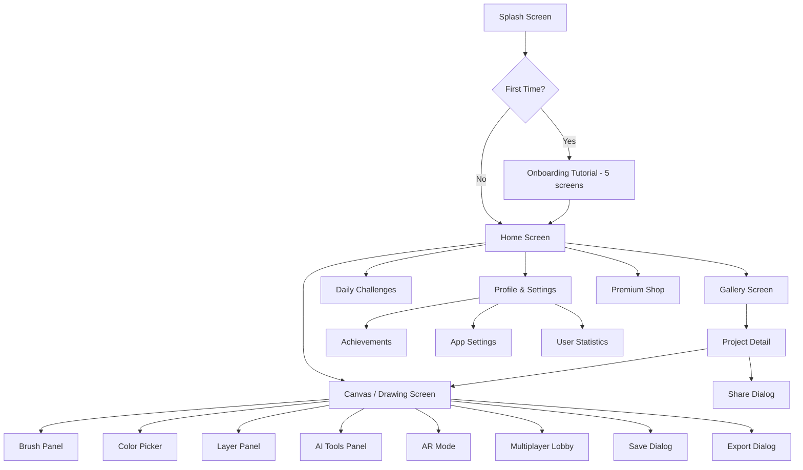

## 16.2 Screen Specifications

### S01: Splash Screen
| Property | Value |
|----------|-------|
| Duration | 2 seconds |
| Animation | Logo fade-in + particle burst |
| Elements | App logo, app name, version |
| Background | Animated gradient mesh |
| Transition | Fade to Home/Onboarding |

### S02: Onboarding (5 Steps)
| Step | Title | Content | Visual |
|------|-------|---------|--------|
| 1 | Welcome | "Create art in the air" | 3D hand animation |
| 2 | Hand Tracking | "We use your camera to track hands" | Camera permission request |
| 3 | Gestures | "Learn the basic gestures" | Interactive gesture demo |
| 4 | Drawing | "Start your first masterpiece" | Quick drawing tutorial |
| 5 | AI & AR | "AI assists you, AR brings art to life" | Feature showcase |

### S03: Home Screen
| Element | Description | Position |
|---------|-------------|----------|
| App Bar | Logo + Settings icon | Top |
| Hero Card | "Start New Canvas" with animated preview | Center top |
| Recent Projects | Horizontal scroll, 3 recent thumbnails | Middle |
| Quick Actions | New Canvas, AR Mode, Multiplayer, AI Studio | Grid, center |
| Daily Challenge | Featured challenge card with countdown | Below quick actions |
| Community Gallery | "Trending Art" horizontal scroll | Bottom |
| Bottom Nav | Home, Gallery, Create (+), Challenges, Profile | Fixed bottom |

### S04: Canvas / Drawing Screen (Main Screen)
| Element | Position | Gesture | Description |
|---------|----------|---------|-------------|
| Camera Feed | Background | — | Real-time camera input |
| Drawing Canvas | Full screen overlay | — | Transparent drawing surface |
| Hand Overlay | Following hand | — | Visual hand tracking feedback |
| Gesture Indicator | Top center | — | Shows current detected gesture |
| Tool Ring | Left edge | Tap | Quick brush/tool selector |
| Color Quick Bar | Bottom | Tap | 5 recent colors + picker |
| Layer Button | Right top | Tap | Opens layer panel |
| AI Button | Right bottom | Tap | Opens AI tools |
| Undo/Redo | Top left | Tap | Undo/Redo buttons (also gesture) |
| Menu Button | Top right | Tap | Hamburger → settings, save, export |
| Zoom Controls | Pinch gesture | — | Canvas zoom and pan |
| Brush Size Indicator | Near cursor | — | Shows current brush size |

### S05: Brush Panel
| Element | Description |
|---------|-------------|
| Category Tabs | Basic, Artistic, Special, Pattern, Eraser |
| Brush Grid | 3-column grid with preview |
| Size Slider | Real-time size adjustment |
| Opacity Slider | Transparency control |
| Flow Slider | Ink flow control |
| Spacing Slider | Distance between stamps |
| Brush Preview | Live preview of current settings |
| Custom Brushes | User-saved brush presets |
| Premium Badge | Lock icon on premium brushes |

### S06: Color Picker
| Element | Description |
|---------|-------------|
| Color Wheel | HSV wheel with brightness slider |
| RGB Sliders | Red, Green, Blue channels |
| HSV Sliders | Hue, Saturation, Value |
| Hex Input | Manual hex code entry |
| Eyedropper | Pick color from canvas |
| Recent Colors | Last 10 used colors |
| Favorite Colors | User-saved colors |
| Palette Browser | Browse preset palettes |
| Current / Previous | Compare current and previous color |

### S07: Layer Panel
| Element | Description |
|---------|-------------|
| Layer List | Vertical stack, drag to reorder |
| Layer Thumbnail | Small preview per layer |
| Visibility Toggle | Eye icon per layer |
| Lock Toggle | Lock icon per layer |
| Opacity Slider | Per-layer opacity |
| Blend Mode Dropdown | Per-layer blend mode |
| Add Layer Button | Create new layer |
| Layer Options Menu | Duplicate, Merge, Delete, Rename |

### S08: AI Tools Panel
| Element | Description |
|---------|-------------|
| Shape Correct Toggle | Auto-correct shapes on/off |
| Sketch Complete Button | AI completes partial drawing |
| Style Transfer Grid | Select art style to apply |
| Auto-Color Button | Colorize black-and-white sketch |
| Sketch-to-Realistic | Convert sketch to photo |
| Object Guess | Shows what AI thinks you're drawing |
| AI Credits Display | Remaining credits counter |
| AI Tutor Button | Start guided drawing session |

### S09: AR Mode Screen
| Element | Description |
|---------|-------------|
| AR Camera View | Real-time AR camera |
| Surface Detection | Visual plane detection overlay |
| Wall Paint Controls | Same as canvas controls |
| 3D Toggle | Switch 2D wall paint ↔ 3D air paint |
| Capture Button | Take AR photo |
| Scale Slider | Adjust painting scale |
| Reset AR | Clear all AR paintings |
| Return Button | Back to regular canvas |

### S10: Gallery Screen
| Element | Description |
|---------|-------------|
| View Toggle | Grid / List / Timeline |
| Search Bar | Search by name, date, tag |
| Filter Chips | All, Local, Cloud, Shared |
| Sort Dropdown | Date, Name, Size |
| Project Card | Thumbnail + name + date + size |
| Select Mode | Multi-select for batch operations |
| Floating Action | New Canvas (+) |
| Empty State | "Create your first masterpiece" illustration |

### S11: Profile & Settings
| Section | Settings |
|---------|----------|
| Account | Display name, email, avatar, subscription status |
| Gesture | Sensitivity sliders, hand mode (L/R), custom mappings |
| Camera | Resolution, FPS, mirror mode, exposure |
| Drawing | Default brush, canvas size, auto-save interval |
| Voice | Enable/disable, language, wake word |
| Audio | Sound effects volume, haptic feedback toggle |
| Theme | Dark/Light mode, theme selection |
| Storage | Cache size, clear cache, cloud usage |
| Privacy | Camera permissions, data collection, analytics opt-out |
| About | Version, licenses, support, rate app |

---

# 17. DATABASE & API DESIGN

## 17.1 Cloud Firestore Schema

### Collections Structure

```
firestore/
├── users/
│   └── {userId}/
│       ├── profile: { displayName, email, avatarUrl, ... }
│       ├── subscription: { plan, expiresAt, aiCredits, ... }
│       ├── settings: { gestureConfig, cameraConfig, ... }
│       ├── stats: { totalDrawings, totalTime, streak, ... }
│       └── achievements/
│           └── {achievementId}: { unlockedAt, progress }
│
├── projects/
│   └── {projectId}/
│       ├── metadata: { name, authorId, createdAt, modifiedAt, ... }
│       ├── thumbnail: { url, width, height }
│       ├── settings: { canvasSize, bgColor, ... }
│       ├── isPublic: boolean
│       ├── tags: string[]
│       └── versions/
│           └── {versionId}: { timestamp, fileUrl, changeNote }
│
├── gallery/ (public/shared artworks)
│   └── {artworkId}/
│       ├── projectId, authorId, title, description
│       ├── imageUrl, thumbnailUrl
│       ├── likes, views, comments
│       ├── tags, category
│       └── createdAt
│
├── challenges/
│   └── {challengeId}/
│       ├── title, description, type
│       ├── startDate, endDate
│       ├── difficulty, xpReward
│       ├── referenceImageUrl
│       └── submissions/
│           └── {submissionId}: { userId, imageUrl, score, submittedAt }
│
├── rooms/ (multiplayer)
│   └── {roomId}/
│       ├── hostId, roomCode, maxPlayers
│       ├── state, createdAt
│       └── players/
│           └── {userId}: { displayName, color, joinedAt }
│
├── brushPacks/
│   └── {packId}/
│       ├── name, description, price
│       ├── thumbnailUrl
│       └── brushIds: string[]
│
└── appConfig/
    └── global/
        ├── minAppVersion, latestVersion
        ├── maintenanceMode: boolean
        ├── featureFlags: { ... }
        └── dailyChallengeId
```

### Detailed Document Schemas

```typescript
// User Profile Document
interface UserProfile {
  uid: string;
  displayName: string;
  email: string;
  avatarUrl: string;
  provider: "email" | "google" | "apple";
  createdAt: Timestamp;
  lastActiveAt: Timestamp;
  
  subscription: {
    plan: "free" | "premium" | "pro";
    startedAt: Timestamp;
    expiresAt: Timestamp;
    autoRenew: boolean;
    platform: "android" | "ios";
    receiptToken: string;
  };
  
  aiCredits: {
    remaining: number;
    monthlyAllocation: number;
    lastResetAt: Timestamp;
    totalUsed: number;
  };
  
  stats: {
    totalDrawings: number;
    totalDrawingTimeSeconds: number;
    totalStrokes: number;
    longestStreak: number;
    currentStreak: number;
    lastDrawingDate: string; // YYYY-MM-DD
    achievementPoints: number;
    level: number;
    xp: number;
  };
}

// Project Document
interface Project {
  projectId: string;
  authorId: string;
  name: string;
  description: string;
  
  canvas: {
    width: number;
    height: number;
    backgroundColor: string; // hex
  };
  
  layers: Array<{
    id: string;
    name: string;
    order: number;
    visible: boolean;
    locked: boolean;
    opacity: number;
    blendMode: string;
  }>;
  
  fileUrl: string;        // Cloud Storage URL for .airpaint file
  thumbnailUrl: string;   // Cloud Storage URL for thumbnail
  
  tags: string[];
  isPublic: boolean;
  
  stats: {
    strokeCount: number;
    layerCount: number;
    fileSize: number;     // bytes
    editDuration: number; // seconds
  };
  
  createdAt: Timestamp;
  modifiedAt: Timestamp;
  version: number;
}
```

## 17.2 Cloud Functions API

### API Endpoints

| Method | Endpoint | Description | Auth |
|--------|----------|-------------|------|
| POST | `/api/v1/ai/sketch-complete` | Complete partial sketch | Required |
| POST | `/api/v1/ai/sketch-to-realistic` | Convert sketch to photo | Required |
| POST | `/api/v1/ai/style-transfer` | Apply art style | Required |
| POST | `/api/v1/ai/auto-color` | Colorize sketch | Required |
| POST | `/api/v1/ai/shape-correct` | Correct shape (batch) | Required |
| GET | `/api/v1/challenges/daily` | Get daily challenge | Optional |
| POST | `/api/v1/challenges/submit` | Submit challenge entry | Required |
| GET | `/api/v1/gallery/trending` | Get trending artworks | Optional |
| POST | `/api/v1/gallery/publish` | Publish artwork | Required |
| GET | `/api/v1/rooms/list` | List available rooms | Required |
| POST | `/api/v1/rooms/create` | Create multiplayer room | Required |
| POST | `/api/v1/rooms/join` | Join room by code | Required |
| GET | `/api/v1/user/stats` | Get user statistics | Required |
| POST | `/api/v1/iap/verify` | Verify purchase receipt | Required |

### API Request/Response Examples

```json
// POST /api/v1/ai/style-transfer
// Request
{
  "image": "<base64-encoded-png>",
  "style": "oil_painting",
  "strength": 0.8,
  "preserveEdges": true,
  "outputSize": "1024x1024"
}

// Response
{
  "success": true,
  "resultImage": "<base64-encoded-png>",
  "creditsUsed": 2,
  "creditsRemaining": 48,
  "processingTimeMs": 3200
}
```

## 17.3 Firebase Realtime Database (Multiplayer Sync)

```json
// Realtime Database Structure
{
  "rooms": {
    "{roomId}": {
      "meta": {
        "host": "userId",
        "code": "ABC123",
        "state": "active",
        "created": 1689120000000
      },
      "players": {
        "{userId}": {
          "name": "Artist1",
          "color": "#FF5722",
          "cursor": { "x": 450, "y": 320 },
          "online": true,
          "lastSeen": 1689120050000
        }
      },
      "strokes": {
        "{strokeId}": {
          "userId": "user123",
          "brush": "pencil_hb",
          "color": "#000000FF",
          "width": 3.0,
          "layer": 0,
          "points": "encoded_binary_string",
          "timestamp": 1689120045000
        }
      }
    }
  }
}
```

## 17.4 Local Database (SQLite)

```sql
-- Projects Table
CREATE TABLE projects (
    id TEXT PRIMARY KEY,
    name TEXT NOT NULL,
    file_path TEXT NOT NULL,
    thumbnail_path TEXT,
    canvas_width INTEGER,
    canvas_height INTEGER,
    layer_count INTEGER DEFAULT 1,
    stroke_count INTEGER DEFAULT 0,
    file_size INTEGER DEFAULT 0,
    is_synced INTEGER DEFAULT 0,
    cloud_project_id TEXT,
    created_at INTEGER NOT NULL,
    modified_at INTEGER NOT NULL,
    last_opened_at INTEGER
);

-- Brush Presets Table
CREATE TABLE brush_presets (
    id TEXT PRIMARY KEY,
    name TEXT NOT NULL,
    category TEXT NOT NULL,
    settings_json TEXT NOT NULL,
    icon_path TEXT,
    is_custom INTEGER DEFAULT 0,
    is_premium INTEGER DEFAULT 0,
    sort_order INTEGER DEFAULT 0
);

-- Color Favorites Table
CREATE TABLE color_favorites (
    id INTEGER PRIMARY KEY AUTOINCREMENT,
    hex_color TEXT NOT NULL,
    palette_name TEXT DEFAULT 'Favorites',
    sort_order INTEGER DEFAULT 0,
    created_at INTEGER NOT NULL
);

-- Drawing Sessions Table (for analytics)
CREATE TABLE drawing_sessions (
    id INTEGER PRIMARY KEY AUTOINCREMENT,
    project_id TEXT,
    started_at INTEGER NOT NULL,
    ended_at INTEGER,
    duration_seconds INTEGER,
    stroke_count INTEGER DEFAULT 0,
    gestures_used TEXT, -- JSON array
    ai_features_used TEXT -- JSON array
);

-- Achievements Table
CREATE TABLE achievements (
    id TEXT PRIMARY KEY,
    category TEXT NOT NULL,
    title TEXT NOT NULL,
    description TEXT NOT NULL,
    icon_name TEXT,
    xp_reward INTEGER DEFAULT 0,
    progress REAL DEFAULT 0,
    target REAL DEFAULT 1,
    unlocked_at INTEGER,
    is_hidden INTEGER DEFAULT 0
);
```

---

# 18. AUTHENTICATION & USER MANAGEMENT

## 18.1 Auth Flow

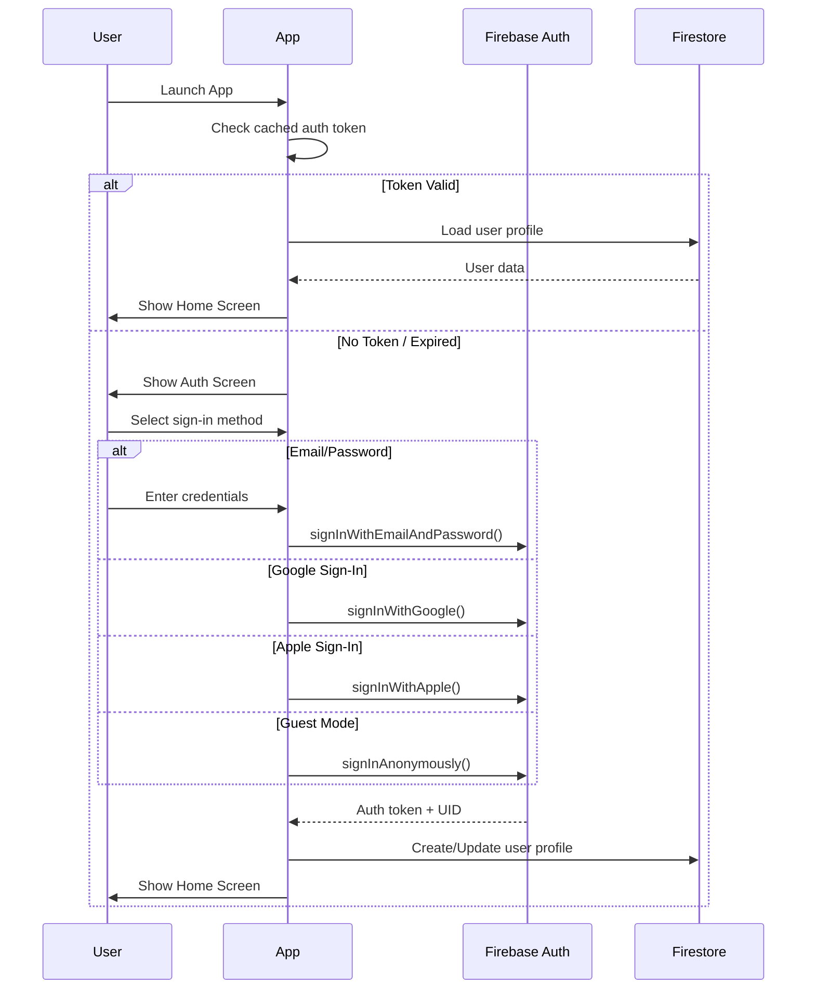

## 18.2 Auth Methods

| Method | Platform | Priority |
|--------|----------|----------|
| Email/Password | Both | P0 |
| Google Sign-In | Both | P0 |
| Apple Sign-In | iOS (required), Android | P0 |
| Anonymous (Guest) | Both | P0 |
| Phone Number | Both | P2 |
| Facebook | Both | P3 |

## 18.3 Guest to Account Conversion

```csharp
// AccountManager.cs
public async Task ConvertGuestToAccount(AuthProvider provider)
{
    var currentUser = FirebaseAuth.DefaultInstance.CurrentUser;
    
    if (!currentUser.IsAnonymous) return;
    
    Credential credential;
    switch (provider)
    {
        case AuthProvider.Google:
            credential = await GetGoogleCredential();
            break;
        case AuthProvider.Apple:
            credential = await GetAppleCredential();
            break;
        case AuthProvider.Email:
            credential = await GetEmailCredential();
            break;
    }
    
    // Link anonymous account to permanent account
    // Preserves all existing data (projects, settings, achievements)
    await currentUser.LinkWithCredentialAsync(credential);
}
```

---

# 19. MONETIZATION & IN-APP PURCHASES

## 19.1 Subscription Tiers

| Feature | Free | Premium ($4.99/mo) | Pro ($9.99/mo) |
|---------|------|---------------------|-----------------|
| Basic Brushes | ✅ (8) | ✅ All (20+) | ✅ All (20+) |
| Colors | ✅ Unlimited | ✅ Unlimited | ✅ Unlimited |
| Layers | 5 | 20 | 50 |
| AI Credits | 10/mo | 100/mo | 500/mo |
| Cloud Storage | 100 MB | 5 GB | 25 GB |
| Cloud Projects | 5 | 100 | Unlimited |
| AR Mode | ✅ Basic | ✅ Full | ✅ Full |
| Multiplayer | ✅ Join only | ✅ Create + Join | ✅ Create + Join |
| Voice Commands | ❌ | ✅ | ✅ |
| Export Formats | PNG, JPEG | + SVG, PSD | + All formats |
| Blend Modes | Normal | All | All |
| Custom Brushes | ❌ | ✅ | ✅ |
| Ad-Free | ❌ | ✅ | ✅ |
| Priority AI | ❌ | ❌ | ✅ |
| Style Transfer Styles | 3 free | 7 styles | All styles |
| Themes | 2 free | 5 themes | All themes |
| Support | Community | Email | Priority email |

## 19.2 One-Time Purchases

| Item | Price | Description |
|------|-------|-------------|
| Brush Pack: Watercolor Pro | $2.99 | 8 premium watercolor brushes |
| Brush Pack: Manga Studio | $2.99 | 10 manga/anime brushes |
| Brush Pack: Calligraphy | $1.99 | 6 calligraphy brushes |
| Theme: Cosmic Collection | $1.99 | 3 cosmic-themed UI skins |
| AI Credit Pack: 50 | $1.99 | 50 additional AI credits |
| AI Credit Pack: 200 | $5.99 | 200 additional AI credits |
| Lifetime Premium | $49.99 | Permanent premium access |

## 19.3 Ad Strategy (Free Tier)

| Ad Type | Placement | Frequency |
|---------|-----------|-----------|
| Rewarded Video | Get 3 AI credits | On demand |
| Rewarded Video | Unlock 1 premium brush (24h) | On demand |
| Interstitial | After saving project | Every 3rd save |
| Banner | Gallery screen bottom | Always visible |
| Native Ad | Between gallery items | Every 6th item |

> [!IMPORTANT]
> Ads must NEVER interrupt the drawing experience. No ads during active canvas sessions.

---

# 20. GAMIFICATION SYSTEM

## 20.1 XP & Levels

```csharp
// LevelSystem.cs
public class LevelSystem
{
    // XP formula: XP_needed = 100 * level^1.5
    public int XPForLevel(int level) => Mathf.RoundToInt(100 * Mathf.Pow(level, 1.5f));
    
    public int GetLevel(int totalXP)
    {
        int level = 1;
        int xpNeeded = 0;
        while (xpNeeded <= totalXP)
        {
            level++;
            xpNeeded += XPForLevel(level);
        }
        return level - 1;
    }
}
```

### XP Sources

| Action | XP |
|--------|-----|
| Complete a drawing | 20 |
| Draw for 10 minutes | 10 |
| Use AI feature | 5 |
| Complete daily challenge | 50 |
| Win multiplayer session | 30 |
| Share artwork | 10 |
| First drawing of the day | 15 |
| Unlock achievement | Varies |
| 7-day streak | 100 |

## 20.2 Achievement Categories

### Drawing Achievements
| Achievement | Requirement | XP |
|-------------|-------------|-----|
| First Stroke | Draw your first stroke | 10 |
| Centurion | Draw 100 drawings | 50 |
| Marathon Artist | Draw for 10 hours total | 100 |
| Color Explorer | Use 50 different colors | 30 |
| Layer Master | Use 10 layers in one project | 40 |
| Brush Collector | Use all free brushes | 30 |

### AI Achievements
| Achievement | Requirement | XP |
|-------------|-------------|-----|
| AI Curious | Use AI for the first time | 10 |
| Style Shifter | Apply 5 different styles | 30 |
| Shape Perfect | Auto-correct 50 shapes | 20 |
| AI Apprentice | Use 100 AI credits | 50 |

### Social Achievements
| Achievement | Requirement | XP |
|-------------|-------------|-----|
| Social Butterfly | Share 10 artworks | 30 |
| Team Player | Complete 5 multiplayer sessions | 40 |
| Challenger | Complete 10 daily challenges | 50 |
| Popular Artist | Get 100 likes on gallery | 100 |

### Streak Achievements
| Achievement | Requirement | XP |
|-------------|-------------|-----|
| Daily Doodler | 3-day streak | 15 |
| Committed Artist | 7-day streak | 30 |
| Dedicated Creator | 30-day streak | 100 |
| Art Machine | 100-day streak | 500 |

## 20.3 Daily Challenges

| Type | Description | Frequency |
|------|-------------|-----------|
| Theme Challenge | Draw something matching a theme (e.g., "Ocean") | Daily |
| Speed Draw | Complete a drawing in under 3 minutes | Weekly |
| Limited Palette | Use only 3 colors | Daily |
| Copy Challenge | Recreate a reference image | Weekly |
| Gesture Only | Use only gestures (no touch buttons) | Daily |
| AI Collaboration | Create art using at least 2 AI features | Weekly |

---

# 21. PERFORMANCE OPTIMIZATION

## 21.1 Performance Targets

| Metric | Target | Maximum Acceptable |
|--------|--------|-------------------|
| Frame Rate | 60 FPS | 45 FPS minimum |
| Camera Latency | < 30ms | < 50ms |
| Hand Detection Latency | < 30ms | < 50ms |
| Total Input Latency | < 80ms | < 120ms |
| App Launch Time | < 3s | < 5s |
| Memory Usage (Drawing) | < 300 MB | < 500 MB |
| Memory Usage (AR Mode) | < 400 MB | < 600 MB |
| Battery Drain | < 15%/hr | < 25%/hr |
| APK Size | < 80 MB | < 120 MB |
| IPA Size | < 100 MB | < 150 MB |
| Crash Rate | < 0.5% | < 1% |

## 21.2 Optimization Strategies

### GPU Optimization
```csharp
// Performance strategies for drawing engine
public class PerformanceOptimizer
{
    // 1. Dynamic Resolution Scaling
    public void AdjustRenderScale(float currentFPS)
    {
        if (currentFPS < 45f)
        {
            // Reduce render scale
            UniversalRenderPipeline.asset.renderScale = 
                Mathf.Max(0.6f, UniversalRenderPipeline.asset.renderScale - 0.05f);
        }
        else if (currentFPS > 58f)
        {
            // Increase render scale
            UniversalRenderPipeline.asset.renderScale = 
                Mathf.Min(1.0f, UniversalRenderPipeline.asset.renderScale + 0.02f);
        }
    }
    
    // 2. Object Pooling for Stroke Points
    private Queue<StrokePoint> pointPool = new();
    
    public StrokePoint GetPoint()
    {
        return pointPool.Count > 0 ? pointPool.Dequeue() : new StrokePoint();
    }
    
    public void ReturnPoint(StrokePoint point)
    {
        pointPool.Enqueue(point);
    }
    
    // 3. Stroke Batching - Merge old strokes into static textures
    public void BakeOldStrokes(int preserveRecentCount = 50)
    {
        var oldStrokes = allStrokes.Take(allStrokes.Count - preserveRecentCount);
        
        // Render old strokes to a static RenderTexture
        foreach (var stroke in oldStrokes)
        {
            RenderStrokeToTexture(stroke, bakedTexture);
        }
        
        // Remove old stroke data from memory
        allStrokes.RemoveRange(0, allStrokes.Count - preserveRecentCount);
    }
    
    // 4. Camera Frame Skipping
    private int frameSkip = 0;
    public bool ShouldProcessFrame()
    {
        frameSkip = (frameSkip + 1) % 2; // Process every other frame
        return frameSkip == 0;
    }
}
```

### Memory Management
```csharp
// MemoryManager.cs
public class MemoryManager : MonoBehaviour
{
    private const long WARNING_THRESHOLD = 400 * 1024 * 1024;  // 400 MB
    private const long CRITICAL_THRESHOLD = 500 * 1024 * 1024; // 500 MB
    
    public void MonitorMemory()
    {
        long memoryUsage = Profiler.GetTotalAllocatedMemoryLong();
        
        if (memoryUsage > CRITICAL_THRESHOLD)
        {
            // Emergency: Force garbage collect, bake strokes, reduce quality
            System.GC.Collect();
            Resources.UnloadUnusedAssets();
            PerformanceOptimizer.BakeOldStrokes(20);
            QualitySettings.DecreaseLevel();
        }
        else if (memoryUsage > WARNING_THRESHOLD)
        {
            // Warning: Gentle cleanup
            PerformanceOptimizer.BakeOldStrokes(50);
        }
    }
}
```

### Battery Optimization
- Reduce camera FPS when idle (30 → 15 FPS)
- Disable hand tracking when drawing menu is open
- Use dark UI theme by default (OLED power saving)
- Batch network requests
- Disable AR plane detection when not in AR mode

---

# 22. FOLDER STRUCTURE & CODE ARCHITECTURE

## 22.1 Complete Unity Project Structure

```
AirPainterAIStudio/
├── Assets/
│   ├── _Project/                          # Project-specific assets
│   │   ├── Scenes/
│   │   │   ├── SplashScene.unity
│   │   │   ├── MainScene.unity
│   │   │   ├── ARScene.unity
│   │   │   └── TestScene.unity
│   │   │
│   │   ├── Scripts/
│   │   │   ├── Core/
│   │   │   │   ├── AppManager.cs          # App lifecycle manager
│   │   │   │   ├── ServiceLocator.cs      # Dependency injection
│   │   │   │   ├── EventBus.cs            # Global event system
│   │   │   │   ├── SceneLoader.cs         # Scene management
│   │   │   │   └── Constants.cs           # App-wide constants
│   │   │   │
│   │   │   ├── Camera/
│   │   │   │   ├── CameraManager.cs       # Camera initialization & feed
│   │   │   │   ├── CameraPermission.cs    # Permission handling
│   │   │   │   └── CameraFrameProvider.cs # Frame capture pipeline
│   │   │   │
│   │   │   ├── HandTracking/
│   │   │   │   ├── IHandTracker.cs        # Interface for hand tracking
│   │   │   │   ├── MediaPipeAndroidBridge.cs
│   │   │   │   ├── MediaPipeiOSBridge.cs
│   │   │   │   ├── HandData.cs            # Hand landmark data structures
│   │   │   │   ├── HandVisualizer.cs      # Debug hand overlay
│   │   │   │   └── HandTrackingManager.cs # Coordinates tracking
│   │   │   │
│   │   │   ├── Gestures/
│   │   │   │   ├── GestureDetector.cs     # Core gesture detection
│   │   │   │   ├── GestureStabilizer.cs   # Filtering & debouncing
│   │   │   │   ├── GestureStateMachine.cs # State machine
│   │   │   │   ├── OneEuroFilter.cs       # Landmark smoothing
│   │   │   │   ├── GestureSettings.cs     # User gesture preferences
│   │   │   │   └── GestureTypes.cs        # Gesture enums & structs
│   │   │   │
│   │   │   ├── Drawing/
│   │   │   │   ├── DrawingEngine.cs       # Main drawing controller
│   │   │   │   ├── Stroke.cs              # Stroke data model
│   │   │   │   ├── StrokePoint.cs         # Point data structure
│   │   │   │   ├── StrokeMeshBuilder.cs   # Mesh generation for strokes
│   │   │   │   ├── StrokeRenderer.cs      # Renders strokes to canvas
│   │   │   │   ├── CatmullRomSpline.cs    # Spline interpolation
│   │   │   │   ├── PressureSimulator.cs   # Velocity-based pressure
│   │   │   │   └── CanvasManager.cs       # Canvas state & transforms
│   │   │   │
│   │   │   ├── Brushes/
│   │   │   │   ├── BrushSettings.cs       # ScriptableObject brush data
│   │   │   │   ├── BrushManager.cs        # Active brush management
│   │   │   │   ├── BrushRenderer.cs       # Brush-specific rendering
│   │   │   │   ├── BrushFactory.cs        # Brush creation factory
│   │   │   │   └── CustomBrushCreator.cs  # User custom brush logic
│   │   │   │
│   │   │   ├── Colors/
│   │   │   │   ├── ColorSystem.cs         # Color management
│   │   │   │   ├── ColorWheel.cs          # HSV wheel logic
│   │   │   │   ├── ColorPalette.cs        # Palette data model
│   │   │   │   ├── ColorPicker.cs         # Color picker UI logic
│   │   │   │   └── Eyedropper.cs          # Pick color from canvas
│   │   │   │
│   │   │   ├── Layers/
│   │   │   │   ├── Layer.cs               # Layer data model
│   │   │   │   ├── LayerManager.cs        # Layer operations
│   │   │   │   ├── LayerCompositor.cs     # Layer blending & compositing
│   │   │   │   └── BlendModes.cs          # Blend mode shaders
│   │   │   │
│   │   │   ├── History/
│   │   │   │   ├── ICommand.cs            # Command interface
│   │   │   │   ├── CommandHistory.cs      # Undo/Redo manager
│   │   │   │   ├── DrawStrokeCommand.cs   # Draw stroke command
│   │   │   │   ├── EraseStrokeCommand.cs  # Erase command
│   │   │   │   ├── LayerCommand.cs        # Layer modification commands
│   │   │   │   └── ColorChangeCommand.cs  # Color change tracking
│   │   │   │
│   │   │   ├── AI/
│   │   │   │   ├── AIManager.cs           # AI feature orchestrator
│   │   │   │   ├── ShapeCorrector.cs      # On-device shape correction
│   │   │   │   ├── ObjectRecognizer.cs    # On-device object recognition
│   │   │   │   ├── SketchCompleter.cs     # Cloud sketch completion
│   │   │   │   ├── StyleTransfer.cs       # Cloud style transfer
│   │   │   │   ├── AutoColorizer.cs       # Cloud auto-coloring
│   │   │   │   ├── AITutor.cs             # Drawing tutorial system
│   │   │   │   ├── AICreditManager.cs     # Credit tracking
│   │   │   │   └── CloudAIClient.cs       # API client for cloud AI
│   │   │   │
│   │   │   ├── AR/
│   │   │   │   ├── ARManager.cs           # AR session management
│   │   │   │   ├── ARWallPainter.cs       # Wall painting logic
│   │   │   │   ├── AirPainter3D.cs        # 3D air painting
│   │   │   │   ├── ARPlaneVisualizer.cs   # Plane detection UI
│   │   │   │   └── ARPhotoCapture.cs      # AR screenshot capture
│   │   │   │
│   │   │   ├── Multiplayer/
│   │   │   │   ├── MultiplayerManager.cs  # Room management
│   │   │   │   ├── RoomBrowser.cs         # Room listing/joining
│   │   │   │   ├── NetworkStrokeSync.cs   # Stroke synchronization
│   │   │   │   ├── PlayerCursorSync.cs    # Cursor position sync
│   │   │   │   └── MultiplayerUI.cs       # Multiplayer UI overlay
│   │   │   │
│   │   │   ├── Voice/
│   │   │   │   ├── VoiceCommandManager.cs # Voice command processing
│   │   │   │   ├── ISpeechRecognizer.cs   # Platform interface
│   │   │   │   ├── AndroidSpeechRecognizer.cs
│   │   │   │   └── iOSSpeechRecognizer.cs
│   │   │   │
│   │   │   ├── SaveLoad/
│   │   │   │   ├── ProjectManager.cs      # Project CRUD operations
│   │   │   │   ├── ProjectFile.cs         # .airpaint file format
│   │   │   │   ├── ProjectSerializer.cs   # Serialize/deserialize
│   │   │   │   ├── CloudSyncManager.cs    # Cloud synchronization
│   │   │   │   ├── AutoSaveManager.cs     # Auto-save system
│   │   │   │   └── ExportManager.cs       # Export to various formats
│   │   │   │
│   │   │   ├── Gallery/
│   │   │   │   ├── GalleryManager.cs      # Gallery data management
│   │   │   │   ├── GalleryItem.cs         # Gallery item data model
│   │   │   │   ├── ShareManager.cs        # Social sharing
│   │   │   │   └── GallerySearch.cs       # Search & filter logic
│   │   │   │
│   │   │   ├── Gamification/
│   │   │   │   ├── LevelSystem.cs         # XP & level progression
│   │   │   │   ├── AchievementManager.cs  # Achievement tracking
│   │   │   │   ├── DailyChallengeManager.cs
│   │   │   │   ├── StreakTracker.cs        # Daily streak system
│   │   │   │   └── XPAnimator.cs          # XP gain UI animation
│   │   │   │
│   │   │   ├── UI/
│   │   │   │   ├── UIManager.cs           # Central UI controller
│   │   │   │   ├── ScreenManager.cs       # Screen navigation
│   │   │   │   ├── GlassmorphismPanel.cs  # Glass effect component
│   │   │   │   ├── AnimatedButton.cs      # Animated button component
│   │   │   │   ├── ThemeManager.cs        # Theme switching
│   │   │   │   ├── SoundManager.cs        # UI sound effects
│   │   │   │   ├── HapticManager.cs       # Haptic feedback
│   │   │   │   ├── ToastNotification.cs   # In-app notifications
│   │   │   │   ├── LoadingOverlay.cs      # Loading states
│   │   │   │   ├── ConfirmDialog.cs       # Confirmation dialogs
│   │   │   │   ├── Screens/
│   │   │   │   │   ├── SplashScreen.cs
│   │   │   │   │   ├── OnboardingScreen.cs
│   │   │   │   │   ├── HomeScreen.cs
│   │   │   │   │   ├── CanvasScreen.cs
│   │   │   │   │   ├── GalleryScreen.cs
│   │   │   │   │   ├── ProfileScreen.cs
│   │   │   │   │   ├── SettingsScreen.cs
│   │   │   │   │   ├── ShopScreen.cs
│   │   │   │   │   └── ChallengesScreen.cs
│   │   │   │   └── Components/
│   │   │   │       ├── BrushPanelUI.cs
│   │   │   │       ├── ColorPickerUI.cs
│   │   │   │       ├── LayerPanelUI.cs
│   │   │   │       ├── AIToolsPanelUI.cs
│   │   │   │       └── ToolRingUI.cs
│   │   │   │
│   │   │   ├── Backend/
│   │   │   │   ├── FirebaseManager.cs     # Firebase initialization
│   │   │   │   ├── AuthManager.cs         # Authentication logic
│   │   │   │   ├── FirestoreManager.cs    # Firestore operations
│   │   │   │   ├── StorageManager.cs      # Cloud Storage operations
│   │   │   │   ├── AnalyticsManager.cs    # Firebase Analytics events
│   │   │   │   ├── RemoteConfigManager.cs # Feature flags
│   │   │   │   ├── IAPManager.cs          # In-app purchases
│   │   │   │   └── PushNotificationManager.cs
│   │   │   │
│   │   │   ├── Data/
│   │   │   │   ├── LocalDatabase.cs       # SQLite wrapper
│   │   │   │   ├── UserPreferences.cs     # User settings persistence
│   │   │   │   └── CacheManager.cs        # Texture/asset caching
│   │   │   │
│   │   │   ├── Performance/
│   │   │   │   ├── PerformanceMonitor.cs  # FPS, memory monitoring
│   │   │   │   ├── ObjectPool.cs          # Generic object pooling
│   │   │   │   ├── MemoryManager.cs       # Memory optimization
│   │   │   │   └── DynamicQuality.cs      # Auto quality adjustment
│   │   │   │
│   │   │   └── Utils/
│   │   │       ├── Extensions.cs          # C# extension methods
│   │   │       ├── MathUtils.cs           # Math helper functions
│   │   │       ├── TextureUtils.cs        # Texture manipulation
│   │   │       ├── CoroutineRunner.cs     # Coroutine utilities
│   │   │       └── DeviceInfo.cs          # Device capability detection
│   │   │
│   │   ├── Prefabs/
│   │   │   ├── UI/
│   │   │   │   ├── GlassPanel.prefab
│   │   │   │   ├── AnimatedButton.prefab
│   │   │   │   ├── Toast.prefab
│   │   │   │   ├── LoadingOverlay.prefab
│   │   │   │   └── ConfirmDialog.prefab
│   │   │   ├── Drawing/
│   │   │   │   ├── StrokeMesh.prefab
│   │   │   │   ├── BrushCursor.prefab
│   │   │   │   └── LineRenderer3D.prefab
│   │   │   └── AR/
│   │   │       ├── ARPlane.prefab
│   │   │       └── PaintDecal.prefab
│   │   │
│   │   ├── Materials/
│   │   │   ├── Brushes/
│   │   │   │   ├── BrushStroke.mat
│   │   │   │   ├── SprayPaint.mat
│   │   │   │   ├── NeonGlow.mat
│   │   │   │   └── Watercolor.mat
│   │   │   ├── UI/
│   │   │   │   ├── GlassMaterial.mat
│   │   │   │   ├── BlurMaterial.mat
│   │   │   │   └── GradientMaterial.mat
│   │   │   ├── AR/
│   │   │   │   ├── ARPaintDecal.mat
│   │   │   │   └── ARLineRenderer.mat
│   │   │   └── PostProcessing/
│   │   │       └── CanvasPostProcess.mat
│   │   │
│   │   ├── Shaders/
│   │   │   ├── BrushStroke.shader
│   │   │   ├── LayerBlend.shader
│   │   │   ├── GlassmorphismUI.shader
│   │   │   ├── NeonGlow.shader
│   │   │   ├── WatercolorEffect.shader
│   │   │   ├── BackdropBlur.shader
│   │   │   └── CanvasGrid.shader
│   │   │
│   │   ├── Textures/
│   │   │   ├── Brushes/
│   │   │   │   ├── pencil_tip.png
│   │   │   │   ├── oil_brush_round.png
│   │   │   │   ├── watercolor_wash.png
│   │   │   │   ├── spray_pattern.png
│   │   │   │   ├── charcoal_grain.png
│   │   │   │   └── ...
│   │   │   ├── UI/
│   │   │   │   ├── icons/
│   │   │   │   ├── backgrounds/
│   │   │   │   └── patterns/
│   │   │   └── Paper/
│   │   │       ├── paper_smooth.png
│   │   │       ├── paper_rough.png
│   │   │       └── canvas_texture.png
│   │   │
│   │   ├── Audio/
│   │   │   ├── SFX/
│   │   │   │   ├── brush_stroke.wav
│   │   │   │   ├── gesture_confirm.wav
│   │   │   │   ├── menu_open.wav
│   │   │   │   ├── menu_close.wav
│   │   │   │   ├── undo.wav
│   │   │   │   ├── redo.wav
│   │   │   │   ├── save_complete.wav
│   │   │   │   ├── achievement.wav
│   │   │   │   └── error.wav
│   │   │   └── Music/
│   │   │       ├── ambient_creative.mp3
│   │   │       └── challenge_bgm.mp3
│   │   │
│   │   ├── Animations/
│   │   │   ├── UI/
│   │   │   │   ├── ButtonPress.anim
│   │   │   │   ├── PanelSlideIn.anim
│   │   │   │   ├── PanelSlideOut.anim
│   │   │   │   ├── FadeIn.anim
│   │   │   │   └── FadeOut.anim
│   │   │   └── Onboarding/
│   │   │       ├── HandGesture_Draw.anim
│   │   │       ├── HandGesture_Pinch.anim
│   │   │       └── HandGesture_Palm.anim
│   │   │
│   │   ├── ScriptableObjects/
│   │   │   ├── Brushes/
│   │   │   │   ├── PencilHB.asset
│   │   │   │   ├── FinePen.asset
│   │   │   │   ├── BoldMarker.asset
│   │   │   │   └── ...
│   │   │   ├── Themes/
│   │   │   │   ├── ThemeMidnight.asset
│   │   │   │   ├── ThemeCosmic.asset
│   │   │   │   └── ...
│   │   │   ├── ColorPalettes/
│   │   │   │   ├── PaletteBasic.asset
│   │   │   │   ├── PalettePastel.asset
│   │   │   │   └── ...
│   │   │   └── Achievements/
│   │   │       ├── DrawingAchievements.asset
│   │   │       ├── AIAchievements.asset
│   │   │       └── SocialAchievements.asset
│   │   │
│   │   ├── AI_Models/                     # TensorFlow Lite models
│   │   │   ├── gesture_classifier.tflite
│   │   │   ├── shape_detector.tflite
│   │   │   ├── object_recognizer.tflite
│   │   │   └── labels.txt
│   │   │
│   │   ├── Fonts/
│   │   │   ├── Inter-Regular.ttf
│   │   │   ├── Inter-Bold.ttf
│   │   │   ├── Inter-SemiBold.ttf
│   │   │   └── Inter-Light.ttf
│   │   │
│   │   ├── Resources/                     # Runtime-loaded assets
│   │   │   ├── DefaultBrushes/
│   │   │   ├── DefaultPalettes/
│   │   │   └── TutorialAssets/
│   │   │
│   │   └── Editor/                        # Editor-only scripts
│   │       ├── BrushPreviewEditor.cs
│   │       ├── ThemePreviewEditor.cs
│   │       └── BuildPipeline.cs
│   │
│   ├── Plugins/
│   │   ├── Android/
│   │   │   ├── mediapipe-hands.aar        # MediaPipe Android plugin
│   │   │   └── libs/
│   │   ├── iOS/
│   │   │   ├── MediaPipeHands.framework   # MediaPipe iOS framework
│   │   │   └── MediaPipeBridge.mm         # ObjC bridge
│   │   └── SQLite/
│   │       └── sqlite3.dll / .so / .dylib
│   │
│   ├── StreamingAssets/                   # Platform-specific assets
│   │   └── ML/
│   │       └── hand_landmark.tflite       # MediaPipe hand model
│   │
│   └── ThirdParty/
│       ├── DOTween/
│       ├── TextMeshPro/
│       ├── Firebase/
│       ├── UnityIAP/
│       └── NativeGallery/
│
├── firebase/                              # Firebase project config
│   ├── firestore.rules
│   ├── storage.rules
│   ├── firebase.json
│   └── functions/
│       ├── package.json
│       ├── index.js
│       └── ai/
│           ├── sketchComplete.js
│           ├── styleTransfer.js
│           ├── autoColor.js
│           └── shapeCorrect.js
│
├── ai-server/                             # AI model serving
│   ├── requirements.txt
│   ├── app.py                             # FastAPI server
│   ├── models/
│   │   ├── sketch_completion/
│   │   ├── style_transfer/
│   │   └── auto_colorize/
│   └── Dockerfile
│
├── docs/
│   ├── PRD.md                             # This document
│   ├── API.md                             # API documentation
│   ├── CONTRIBUTING.md
│   └── CHANGELOG.md
│
├── tests/
│   ├── unit/
│   ├── integration/
│   └── e2e/
│
└── README.md
```

---

# 23. DEVELOPMENT PHASES & SPRINT PLAN

## 23.1 Phase Overview

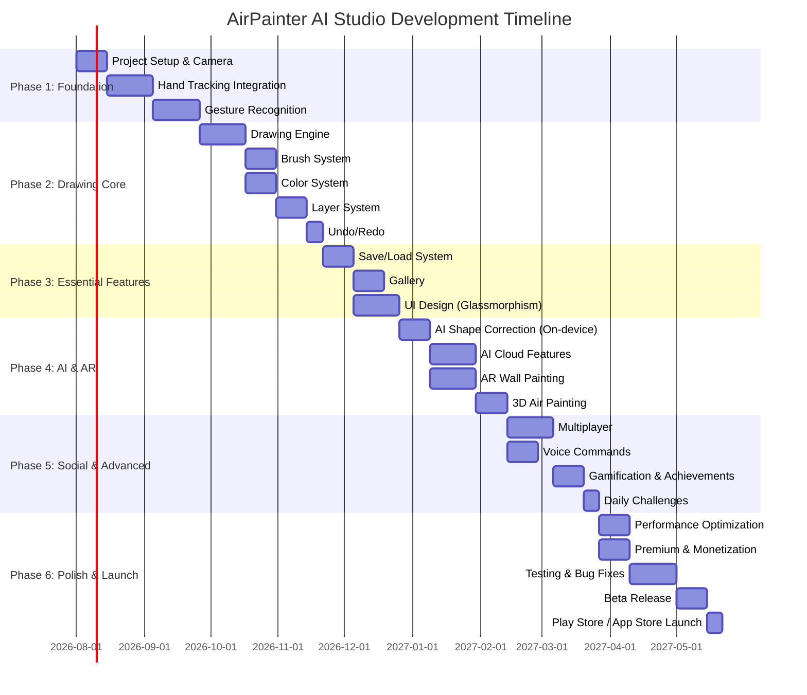

## 23.2 Sprint Breakdown

### Phase 1: Foundation (Weeks 1-8)

#### Sprint 1-2: Project Setup & Camera (Weeks 1-2)
- [ ] Create Unity project with URP
- [ ] Configure Player Settings (Android + iOS)
- [ ] Set up folder structure
- [ ] Install AR Foundation, Firebase SDK
- [ ] Implement CameraManager
- [ ] Handle camera permissions
- [ ] Camera feed rendering on screen
- [ ] Frame capture pipeline

#### Sprint 3-5: Hand Tracking (Weeks 3-5)
- [ ] Integrate MediaPipe Android plugin
- [ ] Integrate MediaPipe iOS plugin
- [ ] Create IHandTracker interface
- [ ] Implement platform bridges
- [ ] Hand landmark data pipeline
- [ ] Hand visualizer (debug overlay)
- [ ] One Euro Filter implementation
- [ ] Performance testing on target devices

#### Sprint 6-8: Gesture Recognition (Weeks 6-8)
- [ ] Implement GestureDetector class
- [ ] Finger extension detection
- [ ] Pinch detection
- [ ] Open palm detection
- [ ] Fist detection
- [ ] Swipe detection
- [ ] Circle gesture detection
- [ ] Gesture stabilizer (debouncing, majority voting)
- [ ] Gesture state machine
- [ ] Gesture settings UI

### Phase 2: Drawing Core (Weeks 9-16)

#### Sprint 9-11: Drawing Engine (Weeks 9-11)
- [ ] Stroke data structures
- [ ] StrokeMeshBuilder
- [ ] Catmull-Rom interpolation
- [ ] Pressure simulation
- [ ] Canvas rendering
- [ ] Finger-to-screen coordinate mapping
- [ ] Drawing with gesture input
- [ ] Performance optimization (object pooling)

#### Sprint 12-13: Brush System (Weeks 12-13)
- [ ] BrushSettings ScriptableObject
- [ ] Brush rendering engine
- [ ] 8 free brushes implementation
- [ ] Brush texture stamping
- [ ] Size/opacity dynamics
- [ ] Brush preview UI
- [ ] Brush selection panel

#### Sprint 13-14: Color System (Weeks 13-14)
- [ ] HSV Color Wheel
- [ ] RGB/HSV sliders
- [ ] Hex input
- [ ] Color palettes
- [ ] Recent colors
- [ ] Eyedropper tool
- [ ] Color picker gesture activation

#### Sprint 15-16: Layers & History (Weeks 15-16)
- [ ] Layer data model
- [ ] Layer compositor
- [ ] Layer UI panel
- [ ] Blend modes shader
- [ ] Visibility/lock toggles
- [ ] Command pattern implementation
- [ ] Undo/Redo system
- [ ] History limits & memory management

### Phase 3: Essential Features (Weeks 17-23)

#### Sprint 17-18: Save/Load (Weeks 17-18)
- [ ] .airpaint file format design
- [ ] Project serialization
- [ ] Local file storage
- [ ] Thumbnail generation
- [ ] Auto-save system
- [ ] Export to PNG/JPEG

#### Sprint 19-20: Gallery (Weeks 19-20)
- [ ] SQLite local database
- [ ] Gallery grid/list views
- [ ] Project thumbnails
- [ ] Search & sort
- [ ] Project detail screen
- [ ] Delete/rename operations

#### Sprint 20-23: UI Design (Weeks 20-23)
- [ ] Glassmorphism shader
- [ ] Theme system
- [ ] All screen layouts
- [ ] UI animations (DOTween)
- [ ] Sound effects integration
- [ ] Haptic feedback
- [ ] Onboarding flow
- [ ] Settings screens

### Phase 4: AI & AR (Weeks 24-33)

#### Sprint 24-25: AI On-Device (Weeks 24-25)
- [ ] TFLite/Sentis integration
- [ ] Shape correction algorithm
- [ ] Object recognition model
- [ ] Shape auto-correct toggle
- [ ] Object guess display

#### Sprint 26-28: AI Cloud (Weeks 26-28)
- [ ] Cloud Functions setup
- [ ] AI API gateway
- [ ] Sketch completion endpoint
- [ ] Style transfer (10 styles)
- [ ] Auto-coloring
- [ ] AI credit system
- [ ] AI tools panel UI

#### Sprint 26-28: AR Wall Painting (Weeks 26-28)
- [ ] AR Foundation setup
- [ ] Plane detection
- [ ] Wall painting decals
- [ ] AR paint controls
- [ ] AR photo capture

#### Sprint 29-30: 3D Air Painting (Weeks 29-30)
- [ ] 3D stroke rendering
- [ ] Depth positioning
- [ ] 3D rotation/view
- [ ] 3D → 2D toggle

### Phase 5: Social & Advanced (Weeks 31-38)

#### Sprint 31-33: Multiplayer (Weeks 31-33)
- [ ] Firebase Realtime DB setup
- [ ] Room creation/joining
- [ ] Stroke synchronization
- [ ] Player cursor sync
- [ ] Multiplayer UI
- [ ] Room browser

#### Sprint 34-35: Voice Commands (Weeks 34-35)
- [ ] Android speech recognition
- [ ] iOS speech recognition
- [ ] Command mapping
- [ ] Voice UI feedback
- [ ] Settings for voice

#### Sprint 36-38: Gamification (Weeks 36-38)
- [ ] XP & Level system
- [ ] Achievement definitions
- [ ] Achievement tracking
- [ ] Daily challenges system
- [ ] Streak tracking
- [ ] Achievement UI
- [ ] Challenge submission

### Phase 6: Polish & Launch (Weeks 39-46)

#### Sprint 39-40: Performance (Weeks 39-40)
- [ ] Profiling & optimization
- [ ] Memory management
- [ ] Battery optimization
- [ ] Dynamic quality scaling
- [ ] Stroke baking system
- [ ] App size optimization

#### Sprint 39-40: Monetization (Weeks 39-40)
- [ ] Firebase Auth integration
- [ ] Unity IAP setup
- [ ] Subscription implementation
- [ ] Premium content gating
- [ ] Ad integration (AdMob)
- [ ] Receipt verification

#### Sprint 41-43: Testing (Weeks 41-43)
- [ ] Unit tests (C#)
- [ ] Integration tests
- [ ] Device compatibility testing
- [ ] Performance benchmarking
- [ ] Beta testing program
- [ ] Crash monitoring (Crashlytics)
- [ ] Bug fixes

#### Sprint 44-45: Beta (Weeks 44-45)
- [ ] Internal testing track
- [ ] Closed beta (100 users)
- [ ] Open beta (1000 users)
- [ ] Feedback collection
- [ ] Final bug fixes

#### Sprint 46: Launch (Week 46)
- [ ] Play Store listing
- [ ] App Store listing
- [ ] App Store assets
- [ ] Launch marketing
- [ ] Monitor post-launch metrics

---

# 24. TESTING STRATEGY

## 24.1 Testing Pyramid

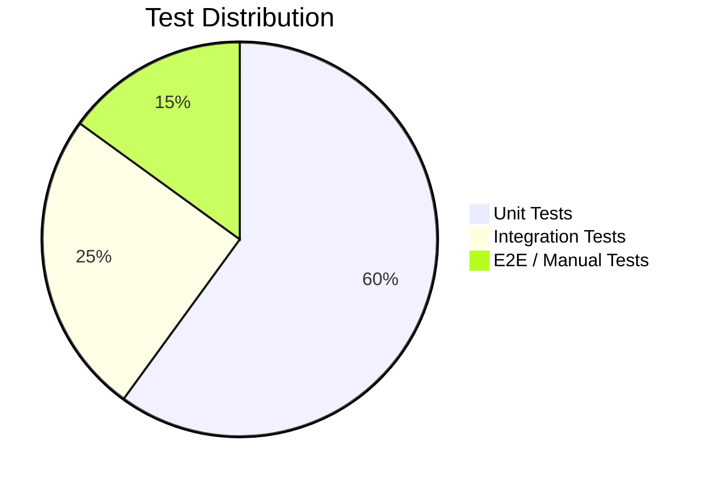

## 24.2 Unit Tests

```csharp
// Example: GestureDetector Tests
[TestFixture]
public class GestureDetectorTests
{
    private GestureDetector detector;
    
    [SetUp]
    public void Setup()
    {
        detector = new GestureDetector();
    }
    
    [Test]
    public void IsPinching_WhenThumbAndIndexClose_ReturnsTrue()
    {
        var hand = CreateHandData();
        hand.landmarks[4].position = new Vector3(0.5f, 0.5f, 0);  // Thumb tip
        hand.landmarks[8].position = new Vector3(0.52f, 0.52f, 0); // Index tip (close)
        
        bool result = detector.IsPinching(hand, out float strength);
        
        Assert.IsTrue(result);
        Assert.Greater(strength, 0.5f);
    }
    
    [Test]
    public void IsPinching_WhenFingersApart_ReturnsFalse()
    {
        var hand = CreateHandData();
        hand.landmarks[4].position = new Vector3(0.3f, 0.3f, 0);
        hand.landmarks[8].position = new Vector3(0.7f, 0.7f, 0);
        
        bool result = detector.IsPinching(hand, out float strength);
        
        Assert.IsFalse(result);
    }
    
    [Test]
    public void IsOpenPalm_AllFingersExtended_ReturnsTrue()
    {
        var hand = CreateFullyOpenHand();
        Assert.IsTrue(detector.IsOpenPalm(hand));
    }
    
    [Test]
    public void IsFist_AllFingersCurled_ReturnsTrue()
    {
        var hand = CreateFistHand();
        Assert.IsTrue(detector.IsFist(hand));
    }
}

// Example: CommandHistory Tests
[TestFixture]
public class CommandHistoryTests
{
    [Test]
    public void Undo_AfterExecute_ReversesCommand()
    {
        var history = new CommandHistory();
        var mockCommand = new MockCommand();
        
        history.ExecuteCommand(mockCommand);
        history.Undo();
        
        Assert.IsTrue(mockCommand.WasUndone);
    }
    
    [Test]
    public void Redo_AfterUndo_ReexecutesCommand()
    {
        var history = new CommandHistory();
        var mockCommand = new MockCommand();
        
        history.ExecuteCommand(mockCommand);
        history.Undo();
        history.Redo();
        
        Assert.AreEqual(2, mockCommand.ExecuteCount);
    }
}
```

## 24.3 Test Coverage Targets

| Module | Target Coverage |
|--------|----------------|
| Gesture Detection | 90% |
| Drawing Engine (Logic) | 85% |
| Command History | 95% |
| Color System | 85% |
| Layer Operations | 90% |
| Data Serialization | 90% |
| AI Credit System | 95% |
| Level/XP System | 90% |
| Overall | 80% |

## 24.4 Device Testing Matrix

| Device | OS | Priority | Notes |
|--------|-----|----------|-------|
| Pixel 7 | Android 14 | P0 | Primary test device |
| Samsung Galaxy S23 | Android 13 | P0 | Samsung optimizations |
| Samsung Galaxy A52 | Android 12 | P0 | Mid-range baseline |
| OnePlus Nord | Android 11 | P1 | Budget device |
| iPhone 15 Pro | iOS 17 | P0 | Primary iOS device |
| iPhone 12 | iOS 16 | P0 | Older flagship |
| iPhone SE 3 | iOS 16 | P1 | Minimum spec |
| iPad Pro M2 | iPadOS 17 | P1 | Tablet testing |

## 24.5 Performance Benchmarks

| Test Scenario | Metric | Pass Criteria |
|---------------|--------|--------------|
| Idle (camera + tracking) | FPS | ≥ 55 FPS |
| Active drawing (50 strokes) | FPS | ≥ 50 FPS |
| Heavy canvas (500 strokes) | FPS | ≥ 45 FPS |
| AR mode active | FPS | ≥ 45 FPS |
| App cold start | Time | ≤ 3 seconds |
| Gesture detection | Latency | ≤ 50 ms |
| Save project (50 strokes) | Time | ≤ 2 seconds |
| Load project | Time | ≤ 3 seconds |
| Memory after 30 min session | Usage | ≤ 400 MB |

---

# 25. DEPLOYMENT & RELEASE

## 25.1 Build Configuration

### Android
```groovy
// build.gradle equivalent settings
minSdkVersion 26
targetSdkVersion 34
compileSdkVersion 34

aaptOptions {
    noCompress '.tflite'
}

buildTypes {
    release {
        minifyEnabled true
        proguardFiles 'proguard-rules.pro'
    }
}

// App Bundle format (AAB) for Play Store
```

### iOS
```
Deployment Target: 14.0
Build Configuration: Release
Code Signing: Automatic
Provisioning: App Store Distribution
Bitcode: Disabled (for MediaPipe compatibility)
Capabilities: Camera, Microphone, ARKit
```

## 25.2 Store Listing

### Play Store

| Field | Content |
|-------|---------|
| App Name | AirPainter AI Studio - Air Drawing |
| Short Description | Paint in the air with hand gestures! AI-powered touch-free digital art studio. |
| Full Description | [See Appendix A] |
| Category | Art & Design |
| Content Rating | Everyone |
| Keywords | air painting, hand tracking, AR drawing, AI art, gesture drawing, digital art |
| Screenshots | 8 screenshots (phone) + 4 (tablet) |
| Feature Graphic | 1024×500 promotional banner |
| Video | 30-second preview video |

### App Store

| Field | Content |
|-------|---------|
| App Name | AirPainter AI Studio |
| Subtitle | Draw in Air with Hand Gestures |
| Category | Graphics & Design |
| Age Rating | 4+ |
| Keywords | airpainting,handtrack,ARdraw,AIart,gesture,digitalart,sketch,painting |
| Privacy URL | https://airpainter.studio/privacy |
| Support URL | https://airpainter.studio/support |

## 25.3 Release Stages

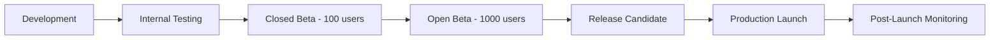

## 25.4 Post-Launch Monitoring

| Metric | Tool | Alert Threshold |
|--------|------|----------------|
| Crash Rate | Crashlytics | > 1% |
| ANR Rate | Play Console | > 0.5% |
| App Rating | Store Console | < 4.0 |
| DAU | Firebase Analytics | < 500 (week 2) |
| Session Length | Firebase Analytics | < 3 min avg |
| Revenue | Revenue Dashboard | Below projection |
| API Latency | Cloud Monitoring | > 5s p95 |
| Error Rate | Cloud Logging | > 2% |

---

# 26. FUTURE ROADMAP

## 26.1 Post-Launch Updates

### Version 1.1 (Month 2)
- Brush import from Procreate (.brush format)
- Additional AI styles (5 more)
- Social gallery (public sharing)
- Leaderboards for challenges
- Bug fixes from launch feedback

### Version 1.2 (Month 4)
- Drawing replay / time-lapse export
- Advanced layer features (groups, masks)
- Collaborative canvas (up to 8 players)
- VR mode support (Meta Quest)
- Custom voice commands

### Version 2.0 (Month 8)
- Smart glasses support (Apple Vision Pro, Meta)
- Hologram drawing preview
- 3D sculpting mode
- AI avatar painter (describe what to draw)
- Community art marketplace

### Version 3.0 (Month 14)
- Full VR painting studio
- AI-generated 3D models from 2D sketches
- Collaborative art rooms (virtual gallery)
- Plugin/extension system
- Desktop companion app (Windows/Mac)

## 26.2 Future Technology Integration

| Technology | Use Case | Timeline |
|------------|----------|----------|
| Apple Vision Pro | Spatial air painting in MR | v2.0 |
| Meta Quest 3 | VR painting environment | v2.0 |
| Gemini API | Advanced AI art assistance | v1.2 |
| WebGPU | Web version for browser | v3.0 |
| NeRF | 3D scene painting from photos | v3.0 |
| Depth Sensors | More accurate 3D positioning | v2.0 |

---

# 27. APPENDICES

## Appendix A: Full Play Store Description

```
🎨 AirPainter AI Studio – Paint in the Air! 🖌️✨

Create stunning digital art without touching your screen! AirPainter AI Studio uses advanced hand tracking and AI technology to let you draw, paint, and create art using only hand gestures in the air.

🖐️ TOUCH-FREE DRAWING
• Draw with your index finger in the air
• Pinch to start/stop drawing
• Open your palm for the color menu
• Make a fist to erase
• Swipe to undo/redo
• And many more intuitive gestures!

🎨 PROFESSIONAL ART TOOLS
• 20+ premium brushes (pencil, oil paint, watercolor, spray, neon glow)
• Unlimited color palette with HSV wheel
• Up to 20 layers with blend modes
• Full undo/redo history
• Export to PNG, JPEG, SVG, PSD

🤖 AI-POWERED FEATURES
• Auto-complete your sketches
• Transform sketches into realistic images
• Apply 10+ artistic styles (anime, oil paint, watercolor, cyberpunk)
• Smart shape correction
• Auto-coloring for black & white sketches
• AI drawing tutor for beginners

📱 AR PAINTING
• Paint on real walls using AR
• Create 3D drawings in space
• Capture AR photos of your creations

👥 MULTIPLAYER
• Draw together with up to 4 friends
• Real-time synchronized canvas
• Create collaborative masterpieces

🎤 VOICE CONTROL
• Control everything with voice commands
• "Red" → Changes color to red
• "Undo" → Undoes last stroke
• "Save" → Saves your work

🏆 GAMIFICATION
• Daily drawing challenges
• Earn XP and level up
• Unlock 50+ achievements
• Maintain your daily streak

✨ PREMIUM DESIGN
• Beautiful glassmorphism UI
• Dark & light themes
• Smooth animations
• Premium sound effects

Download now and start creating art in the air! 🚀
```

## Appendix B: Security Rules

### Firestore Security Rules
```
rules_version = '2';
service cloud.firestore {
  match /databases/{database}/documents {
    // User profiles
    match /users/{userId} {
      allow read: if request.auth != null;
      allow write: if request.auth.uid == userId;
    }
    
    // Projects
    match /projects/{projectId} {
      allow read: if resource.data.isPublic == true 
                  || resource.data.authorId == request.auth.uid;
      allow create: if request.auth != null 
                    && request.resource.data.authorId == request.auth.uid;
      allow update, delete: if resource.data.authorId == request.auth.uid;
    }
    
    // Gallery (public artworks)
    match /gallery/{artworkId} {
      allow read: if true;
      allow create: if request.auth != null;
      allow update, delete: if resource.data.authorId == request.auth.uid;
    }
    
    // Challenges
    match /challenges/{challengeId} {
      allow read: if true;
      
      match /submissions/{submissionId} {
        allow read: if true;
        allow create: if request.auth != null
                      && request.resource.data.userId == request.auth.uid;
      }
    }
    
    // Multiplayer rooms
    match /rooms/{roomId} {
      allow read: if request.auth != null;
      allow create: if request.auth != null;
      allow update: if request.auth != null 
                    && request.auth.uid in resource.data.playerIds;
      allow delete: if resource.data.hostId == request.auth.uid;
    }
    
    // App config (read-only)
    match /appConfig/{doc} {
      allow read: if true;
      allow write: if false;
    }
  }
}
```

### Cloud Storage Security Rules
```
rules_version = '2';
service firebase.storage {
  match /b/{bucket}/o {
    // User project files
    match /users/{userId}/projects/{allPaths=**} {
      allow read: if request.auth.uid == userId;
      allow write: if request.auth.uid == userId
                   && request.resource.size < 50 * 1024 * 1024  // 50 MB limit
                   && request.resource.contentType.matches('image/.*|application/octet-stream');
    }
    
    // Public gallery images
    match /gallery/{imageId} {
      allow read: if true;
      allow write: if request.auth != null
                   && request.resource.size < 10 * 1024 * 1024  // 10 MB limit
                   && request.resource.contentType.matches('image/.*');
    }
    
    // Brush packs (read-only for users)
    match /brushPacks/{allPaths=**} {
      allow read: if request.auth != null;
    }
  }
}
```

## Appendix C: Analytics Events

| Event Name | Parameters | Trigger |
|------------|-----------|---------|
| `app_open` | `source`, `is_first` | App launch |
| `drawing_start` | `canvas_size`, `is_new` | Start drawing |
| `drawing_end` | `duration`, `stroke_count`, `layer_count` | End drawing |
| `gesture_used` | `gesture_type`, `success` | Gesture recognized |
| `brush_selected` | `brush_id`, `is_premium` | Brush change |
| `color_changed` | `hex`, `method` (wheel/slider/palette) | Color change |
| `ai_feature_used` | `feature`, `credits_used`, `duration` | AI feature |
| `ar_mode_entered` | `duration` | AR activation |
| `project_saved` | `file_size`, `is_cloud` | Save project |
| `project_exported` | `format`, `file_size` | Export artwork |
| `challenge_completed` | `challenge_id`, `score` | Challenge done |
| `achievement_unlocked` | `achievement_id`, `xp_earned` | Achievement |
| `subscription_started` | `plan`, `price` | Subscription purchase |
| `subscription_cancelled` | `plan`, `reason` | Subscription cancel |
| `share_artwork` | `platform` | Social share |
| `multiplayer_joined` | `room_type`, `player_count` | Join multiplayer |
| `voice_command_used` | `command`, `success` | Voice command |

## Appendix D: Accessibility Considerations

| Feature | Implementation |
|---------|---------------|
| High Contrast Mode | Alternative high-contrast UI theme |
| Large Text | Scalable UI elements |
| Screen Reader | VoiceOver / TalkBack labels for all UI elements |
| One-Hand Mode | All gestures configurable for single hand |
| Color Blind Modes | Protanopia, Deuteranopia, Tritanopia filters |
| Reduced Motion | Disable animations option |
| Voice Feedback | Audio descriptions of gestures and actions |
| Alternative Input | On-screen touch controls fallback |

## Appendix E: Localization Plan

| Language | Code | Priority | Status |
|----------|------|----------|--------|
| English | en | P0 | Launch |
| Hindi | hi | P0 | Launch |
| Spanish | es | P1 | v1.1 |
| Portuguese | pt-BR | P1 | v1.1 |
| Japanese | ja | P1 | v1.1 |
| Korean | ko | P1 | v1.1 |
| Simplified Chinese | zh-CN | P1 | v1.1 |
| French | fr | P2 | v1.2 |
| German | de | P2 | v1.2 |
| Russian | ru | P2 | v1.2 |
| Arabic | ar | P2 | v1.2 (RTL support) |
| Indonesian | id | P3 | v2.0 |

---

> **Document End**
> 
> This is a living document. Updates will be tracked via version control.
> For questions, contact the development team.
